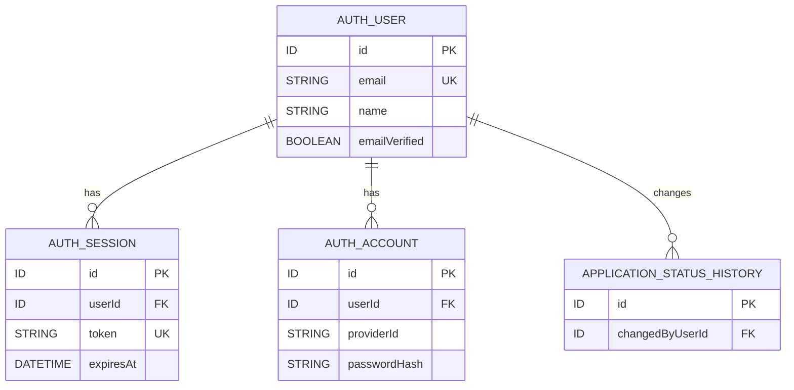
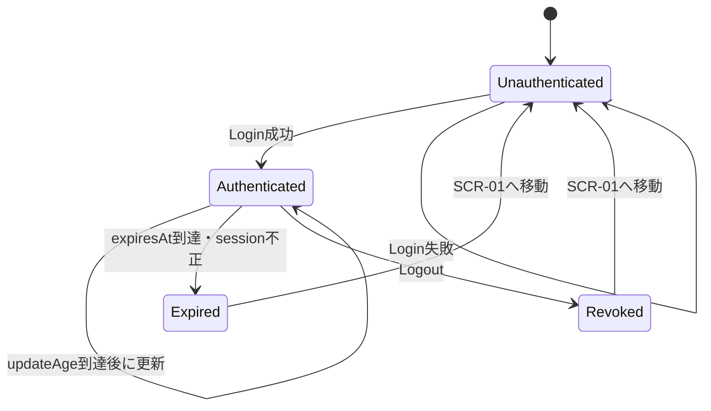
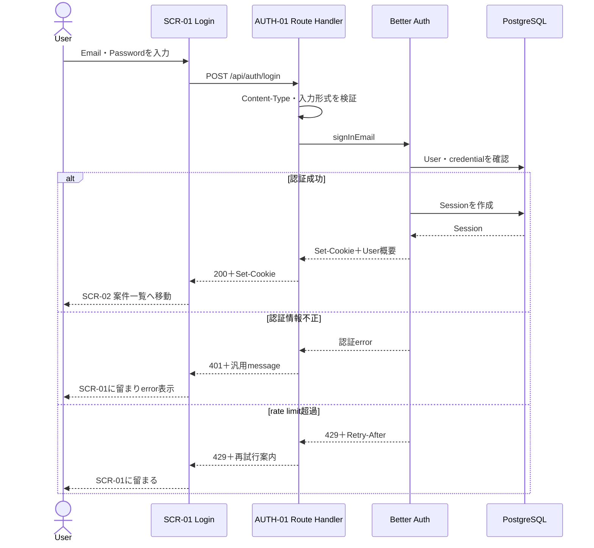
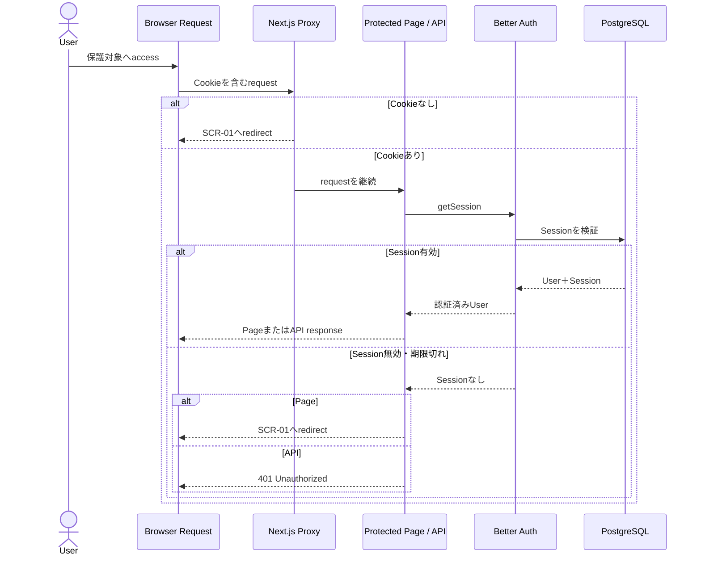
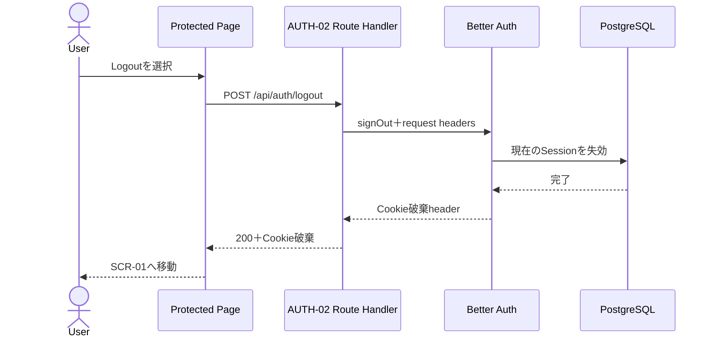

# Sprint 1 認証方式・セッション設計

## 1. 文書情報

|項目|内容|
|---|---|
|対応Issue|DESIGN-06|
|対象|Agent Job Tracker Sprint 1|
|目的|Login、認証状態、未認証access制御およびLogoutを実装できる設計を定める|
|前提技術|Next.js 16、Better Auth、Prisma 7、PostgreSQL 18|
|位置付け|認証基本設計。物理schemaと実装codeは後続Issueで作成する|
|設計基準日|2026-08-24|

本書は、要求定義書、DESIGN-01〜05およびTECH-01を基に、Sprint 1の認証方式とsession管理を具体化する。

既存資料から確定できる製品要件、Developerが採用する技術判断、PRでPM承認を受ける製品判断、後続実装で定める物理値を区別する。

---

## 2. 対象範囲

### 2.1 対象

- SCR-01 Login画面
- AUTH-01 Login
- AUTH-02 Logout
- SCR-02〜SCR-09の未認証access制御
- AC、JOBおよびAPP APIのsession検証
- 認証中UserとApplicationStatusHistory変更者の対応
- 事前作成する1Userのbootstrap
- Password、session、Cookie、CSRF、rate limit、secretおよびlogの基本方針
- 認証に関するUnit、IntegrationおよびE2E test観点

### 2.2 対象外

- 利用者向けsign-up
- Password再設定画面とそのE2E test
- Email verification画面
- Social login、passkeyおよびmulti-factor authentication
- 複数User間のrole・permission
- User管理画面
- Sprint 2以降の認証拡張
- Prisma schema、migration、seedおよび認証codeの実装
- Production domainとhosting事業者固有設定

---

## 3. 用語と決定区分

|区分|意味|
|---|---|
|確定要件|要求定義書または承認済み設計から確定できる製品仕様|
|Developer採用案|一般的なsecurity設計とTECH-01の採用技術に基づく案。PRでPMレビューを受ける|
|後続実装事項|基本方針は本書で定めるが、物理名や環境固有値を実装時に決める事項|

本書でDeveloper採用案とした製品動作は、PRのApproveおよびmergeをもってSprint 1の決定事項として扱う。

---

## 4. 既存資料から確定できる内容

- Sprint 1では認証基盤またはDBへ事前作成した1Userだけを使用する
- 利用者向けUser登録機能を実装しない
- 正しい認証情報でLoginできる
- Login成功後はSCR-02 案件一覧へ移動する
- Login画面以外の画面は認証を必要とする
- 未認証状態で保護対象画面の内容を表示しない
- Login API以外のAPIは認証を必要とする
- 未認証の保護対象APIは`401 Unauthorized`を返す
- Logout後はSCR-01へ移動し、保護対象画面・APIを利用できない
- DesktopとMobileは同じ認証方式を使用する
- Sprint 1では独自のPassword再設定画面を実装しない
- ApplicationStatusHistoryは変更者Userを必須で記録する
- Userの認証情報・sessionの物理構造は認証設計で決定する

---

## 5. Developer採用案の要約

|項目|採用案|区分|
|---|---|---|
|認証library|Better Auth|TECH-01確定|
|認証方式|Email address＋Password|Developer採用案|
|利用者向けsign-up|無効|確定要件|
|Email verification|Sprint 1では要求しない|Developer採用案|
|Session|PostgreSQLに保持するstateful DB session|Developer採用案|
|Session cookie|Opaque token、HttpOnly、productionでSecure、SameSite=Lax、host-only|Developer採用案|
|Session有効期間|7日|Developer採用案|
|Session更新|利用中は1日ごとに有効期限を7日先へ更新|Developer採用案|
|Remember me UI|設けない|Developer採用案|
|Login後の遷移|常にSCR-02 案件一覧|既存決定を具体化|
|Login失敗message|EmailまたはPasswordのどちらが原因か明かさない|Developer採用案|
|Login rate limit|Better Authの`/sign-in/email`標準である10秒3回を使用|Developer採用案|
|Rate limit保存|PostgreSQL|Developer採用案|
|Session確認API|Sprint 1では独立公開APIを追加しない|Developer採用案|
|論理User|Better AuthのUser recordを製品内Userとして参照|Developer採用案|

---

## 6. Email address＋Passwordを採用する理由

### 6.1 採用理由

- Better Authのcore機能だけで実現でき、username pluginを追加しなくてよい
- 初期Userを事前作成する運用でも一意のLogin識別子を用意しやすい
- 将来、Password再設定やEmail verificationを採用する場合に拡張しやすい
- Passwordのhashing、比較およびsession作成を自作しなくてよい
- Login識別子を内部User IDにしないため、内部IDを利用者へ公開しない

SCR-01の入力項目は次の2つとする。

|項目|入力type|補足|
|---|---|---|
|Email address|`email`|前後空白を除去し、形式を検証する。大文字小文字の最終正規化は実装時にBetter Auth仕様と合わせる|
|Password|`password`|画面、log、URLおよびerror responseへ値を出さない|

### 6.2 代表的な代替案

|案|利点|欠点|判断|
|---|---|---|---|
|Email＋Password|Better Auth coreで実現でき、将来機能へ拡張しやすい|課題用UserにもEmail形式の値が必要|採用|
|Username＋Password|Emailを持たない運用に向く|username pluginと追加schemaが必要|Sprint 1では不採用|
|固定共有Passwordのみ|入力とdataが少ない|利用者を識別できず、履歴変更者と対応しにくい|不採用|
|Social login|Passwordをapplication側で扱わない|外部provider設定とaccount依存が増える|Sprint 1対象外|

---

## 7. Userと認証dataの責務

### 7.1 論理Userの実現方法

DESIGN-05の論理Userは、Better Authが管理するUser recordで実現する。業務用User tableを重複して作らない。

図は責務と参照関係を示す論理・技術対応図であり、物理table名、column名およびDB型を確定しない。Password hashはUser recordではなくcredential account側でBetter Authが管理する。

### 7.2 ApplicationStatusHistoryとの対応

- 認証済みsessionからBetter Auth User IDを取得する
- Application Serviceへ`actorUserId`として明示的に渡す
- status変更とhistory作成を同一transactionで実行する
- clientから送信されたUser IDを変更者として信用しない
- Userが取得できない場合はstatus変更を開始しない

---

## 8. 初期Userのbootstrap

### 8.1 基本方針

- Publicなsign-up endpointはproductionで無効化する
- 初期Userはserver側だけで実行できるbootstrap scriptから作成する
- scriptはBetter Authのserver APIを使用し、libraryのPassword hashingとdatabase hookを通す
- deployed applicationのRoute Handlerからbootstrap処理を呼び出せないようにする
- repositoryへ実在Email、PasswordおよびPassword hashを保存しない
- Passwordはcommand line argumentへ直接書かず、対話入力またはsecret環境変数から受け取る
- 既にUserが存在する場合は原則として失敗し、明示的な破壊的optionを設けない

### 8.2 実装方針

production application用auth設定では`disableSignUp: true`とする。

bootstrap scriptでは、HTTP routeへmountしない専用auth instanceを使用し、同じDB adapterとPassword policyでserver-side `signUpEmail`相当の処理を1回だけ実行する。作成後の通常applicationではsign-upを受け付けない。

Admin pluginはUser roleや管理endpointなどSprint 1で不要なschema・機能を増やすため、初期User作成だけを目的として採用しない。

### 8.3 初期User情報

|項目|方針|
|---|---|
|Email|環境ごとにsecretまたは管理値として与える。repositoryにはexampleだけ置く|
|Name|履歴上の変更者表示に利用できる管理値。具体的表示は後続実装で確認|
|Password|十分な長さのrandom値を使用し、平文をcommit・log出力しない|
|Email verified|Sprint 1ではEmail送信を行わないためLogin条件に使用しない|

---

## 9. Session設計

### 9.1 Stateful DB session

Better Authのtraditional cookie-based sessionを使用する。BrowserのCookieにはopaqueなsession tokenを保持し、Userと有効期限などのsession本体はPostgreSQLへ保持する。

採用理由は次のとおりである。

- Logout時にserver側sessionを即時失効できる
- 保護対象requestごとに有効なUserを確認できる
- 1UserのMVPでは追加のRedisを必要としない
- JWTだけを使用する方式より失効を理解しやすい
- ApplicationStatusHistoryの変更者を現在のUserへ安全に対応できる

### 9.2 有効期間

|設定|採用値|理由|
|---|---:|---|
|`expiresIn`|7日|Better Auth標準値を採用し、日常利用で過度な再Loginを避ける|
|`updateAge`|1日|Better Auth標準値を採用し、利用中のsessionをrolling更新する|
|Cookie cache|Sprint 1では無効|1User規模ではDB確認を省略する利点より、失効の即時性と単純さを優先|
|Remember me UI|なし|有効期間を利用者が切り替える要件がない|

7日と1日は製品動作へ影響するため、PRでPMレビューを受ける。将来、共有端末利用やsecurity要件が追加された場合は短縮またはabsolute expirationを再検討する。

### 9.3 Sessionの状態

---

## 10. Cookie方針

|属性|方針|理由|
|---|---|---|
|Value|推測困難なopaque session token|User情報や権限情報をBrowserへ直接保持しない|
|HttpOnly|有効|client JavaScriptからtokenを読ませない|
|Secure|productionで有効|HTTPS以外へ送信しない|
|SameSite|Lax|通常のsame-origin操作を維持しつつ多くのcross-site requestを抑止|
|Path|`/`|保護対象画面とAPIで同じsessionを使用する|
|Domain|指定しないhost-only|cross-subdomain共有の要件がない|
|Prefix|Better Authのdefaultを基本とする|不要なcustomizationを避ける|

- ProductionではHTTPSを必須とする
- `useSecureCookies`の最終設定は環境識別と合わせて実装する
- cross-subdomain cookieを有効化しない
- JavaScriptでsession tokenをlocalStorageまたはsessionStorageへ保存しない
- Cookie名と物理的なprefixは実装時に確認し、外部API契約にしない

---

## 11. 認証endpointとAPI契約

### 11.1 Applicationが公開するendpoint

|API ID|Method・Path|役割|Better Auth処理|
|---|---|---|---|
|AUTH-01|`POST /api/auth/login`|Email・Passwordを検証しsessionを開始|server-side `signInEmail`へadapterする|
|AUTH-02|`POST /api/auth/logout`|現在のsessionを失効しCookieを破棄|server-side `signOut`へadapterする|

DESIGN-04のAPI pathを維持するため、Route Handlerを薄いadapterとして設ける。BrowserはBetter Auth固有pathへ直接依存しない。

Route HandlerはBetter Authが返す`Set-Cookie`を失わずにclientへ返し、library内部errorをapplicationの共通error形式へ変換する。

### 11.2 Better Auth catch-all route

Sprint 1のEmail・Password認証では、ApplicationのAUTH-01・02からserver APIを直接呼べるため、Better Authの全endpointをBrowserへ公開するcatch-all routeは原則として設けない。

実装上catch-all routeが必要になった場合は、次を満たすことを確認してから追加する。

- sign-upが無効である
- Sprint 1対象外endpointが利用者向け機能として露出しない
- trusted originとrate limitが適用される
- AUTH-01・02と二重の公開契約にならない

### 11.3 Session確認API

Sprint 1では独立した公開`GET /api/auth/session`を追加しない。

- Server Componentはserver側でsessionを取得する
- Route Handlerは処理開始時にsessionを取得する
- Client操作中にsessionが失効した場合は対象APIの`401`で検出する
- `401`受信後は保護対象dataを破棄し、SCR-01へ移動する

Polling用のSession APIは現在の利用規模で不要である。Clientだけで長時間動作する画面が追加された場合に再検討する。

---

## 12. 認証確認の責務

|場所|責務|注意点|
|---|---|---|
|Next.js Proxy|Cookie存在による早期redirectを補助|Cookie存在だけを正式な認証判定にしない|
|Protected Page / Layout|DB sessionを検証してから保護対象内容をrender|無効時はSCR-01へredirect|
|Route Handler|DB sessionを検証し、UserをApplication Serviceへ渡す|無効時は`401`。業務処理を開始しない|
|Application Service|受け取ったactorUserIdを変更者として使用|client入力のUser IDを使用しない|
|Client|`401`を検出して認証済みstateを破棄|tokenを直接読まない|

ProxyのCookie確認はoptimisticなnavigation補助である。すべての保護対象PageとAPIで有効なDB sessionを改めて確認する。

---

## 13. Login sequence

Login成功後は常にSCR-02へ移動する。未認証access前のURLを復元しない。

理由は、既存資料でLogin成功後の初期画面がSCR-02と決定されていること、Sprint 1のroute数では復元機能の利点が小さいこと、外部入力URLを利用したopen redirect対策を増やさずに済むことである。

---

## 14. 保護対象access sequence

未認証・期限切れ時に、保護対象dataを一瞬でもrenderしてから隠す方式を採用しない。

---

## 15. Logout sequence

- Logoutはstate変更のため`POST`を使用する
- Logout成功後はbrowser historyやcacheから保護対象dataを再表示しないようにする
- 別tabで開いていた画面は、次回API requestの`401`またはnavigation時のsession確認で失効を検出する
- Logout失敗時にclient側表示だけをLogin済みのまま維持するかは、server sessionの結果を基準に判断する

---

## 16. CSRF・Origin方針

### 16.1 Better Auth endpoint

Better Authが提供する次の防御を利用する。

- state変更requestを単純requestにしない設計
- `Origin`・`Referer`と`trustedOrigins`の照合
- `SameSite=Lax` Cookie
- Login時のFetch Metadata検証
- state変更を`GET`で行わない

`BETTER_AUTH_URL`または明示的なbase URLを設定し、許可するoriginをdevelopment、testおよびproductionごとにallowlist化する。Wildcardで任意originを許可しない。

### 16.2 Application API

Better AuthのCSRF防御は独自のAC・JOB・APP Route Handlerへ自動適用されるとは限らないため、state変更APIでは次を行う。

- `Content-Type: application/json`を要求する
- `Origin`をapplicationのallowlistと照合する
- Browser向けAPIでcross-origin requestを許可しない
- CORSを安易に`*`へしない
- `GET`ではdataを変更しない

SameSite Cookieだけに依存せず、Origin検証を共通Route Handler helperとして実装する。Cross-origin clientが将来追加された場合は、CSRF tokenまたは別の認証方式を再設計する。

---

## 17. Rate limitとLogin失敗

### 17.1 Rate limit

- ProductionでBetter Authのbuilt-in rate limitを有効にする
- `/sign-in/email`は標準ruleの10秒3回を採用する
- Serverlessや複数instanceでも共有できるよう、rate limit状態をPostgreSQLへ保存する
- Reverse proxy配下のclient IP headerはhosting決定後にtrusted proxy設定と合わせる
- `429 Too Many Requests`と`Retry-After`相当をclientへ伝える
- Developmentでは通常無効、Integration/E2E testでは明示的に有効化できる構成とする

10秒3回は短時間のbrute-forceを抑えつつ、入力mistakeから回復しやすいBetter Auth標準ruleである。長期的なaccount lockはSprint 1では導入しない。

### 17.2 Login error

|状況|HTTP候補|利用者向け方針|
|---|---:|---|
|未入力・Email形式不正|422|対象fieldの入力を確認するよう案内|
|EmailまたはPassword不一致|401|「Email addressまたはPasswordが正しくありません」と表示|
|Rate limit超過|429|一定時間後に再試行するよう案内|
|認証基盤・DB error|500|時間を置いて再試行するよう案内|

存在しないEmailとPassword不一致で異なるmessageを出さない。Better Auth内部error、stack trace、SQLおよびaccount存在有無をclientへ返さない。

---

## 18. Password方針

- Better Auth標準のPassword hashingを使用し、自作hashingを行わない
- Passwordの平文をDB、log、URL、analyticsおよびrepositoryへ保存しない
- 初期UserのPasswordはrandom生成し、安全な経路で利用者へ渡す
- Better Auth標準の最小8文字・最大128文字を技術上の下限とし、bootstrapではより長いrandom Passwordを使用する
- Login画面では入力値を再表示しない
- Login失敗後にPasswordを保持するかは、securityを優先してclearするDeveloper案とする
- Password変更・再設定はSprint 1の画面対象外とする

将来Password変更を追加する場合は、他sessionの失効、現在Passwordの再確認およびPassword policyを別Issueで設計する。

---

## 19. Secretと環境変数

|変数候補|用途|Git管理|
|---|---|---|
|`DATABASE_URL`|Prisma・Better AuthのDB接続|実値は不可|
|`BETTER_AUTH_SECRET`|Cookie・token等の署名secret|実値は不可|
|`BETTER_AUTH_URL`|認証base URLとorigin基準|`.env.example`はdummy可|
|`BOOTSTRAP_USER_EMAIL`|初期User作成|実値は不可|
|`BOOTSTRAP_USER_NAME`|初期User表示名|実値は不可|
|`BOOTSTRAP_USER_PASSWORD`|初期Password。対話入力を優先|実値は不可|

- `.env.example`には変数名、用途およびdummy値だけを記載する
- `.env.local`と環境別secret fileを`.gitignore`へ含める
- Productionではhostingのsecret storeを使用する
- Secretをclient bundleへ公開する`NEXT_PUBLIC_`へ設定しない
- Secret rotation時に既存sessionが失効する可能性を運用手順へ記載する

---

## 20. Log方針

### 20.1 記録候補

- Login成功・失敗のevent種別
- Logout成功・失敗
- Session不正・期限切れ
- Rate limit発生
- request ID、発生日時、処理時間およびerror分類
- User IDは必要なserver logに限定し、Emailより内部IDを優先する

### 20.2 記録禁止

- PasswordとPassword hash
- Session tokenとCookie全体
- `Authorization` header
- Secret・DB接続情報
- Request bodyの無加工出力
- 必要性のないEmail、担当者連絡先およびJob詳細

Sprint 1では専用監視serviceを先に導入せず、構造化logへ出力できるinterfaceを用意する。保持期間とalertはhosting決定後に設計する。

---

## 21. 画面・APIとの対応

|対象|認証状態|処理|
|---|---|---|
|SCR-01 Login|未認証|AUTH-01を実行。成功後SCR-02へ移動|
|SCR-02〜09|認証必須|Page/Layoutでsession検証。無効時SCR-01へ移動|
|UI-05 Logout|認証必須|AUTH-02を実行。成功後SCR-01へ移動|
|AC-01〜05|認証必須|Route HandlerでsessionとUserを検証|
|JOB-01〜05|認証必須|Route HandlerでsessionとUserを検証|
|APP-01〜02|認証必須|Route HandlerでsessionとUserを検証|
|APP-02|認証必須|認証中User IDをhistory変更者として使用|

Mobileでも同じCookie、sessionおよびAPIを使用する。Native application用token認証はSprint 1の対象外である。

---

## 22. Test方針

### 22.1 Unit test

- Login入力schema
- Better Auth errorからapplication errorへのmapping
- Origin allowlist判定
- `401`・`429`時のclient遷移判定
- 認証中User IDをApplication Serviceへ渡す処理

### 22.2 Integration test

- 正しいEmail・PasswordでsessionとCookieが作成される
- 不正な資格情報でsessionが作成されない
- sign-upが拒否される
- Cookieなし、期限切れ、改ざんtokenで保護対象APIが`401`になる
- 有効なsessionで保護対象APIを利用できる
- Logoutでsessionが失効し、同じCookieを再利用できない
- APP-02が認証中UserをApplicationStatusHistoryへ記録する
- Rate limit状態がDBで共有される

### 22.3 E2E test

- DesktopとMobileでLoginできる
- Login成功後にSCR-02へ移動する
- Login失敗時にSCR-01へ留まり汎用messageを表示する
- 未認証で保護対象URLへaccessすると内容を表示せずSCR-01へ移動する
- 未認証で保護対象APIを呼ぶと`401`になる
- Logout後にbrowser backを使用しても保護対象操作ができない
- 別tab相当でsession失効を検出できる
- 連続Login失敗で`429`と再試行案内を確認できる

Test用UserとPasswordはtest環境だけで作成し、productionの資格情報を使用しない。

---

## 23. Security確認項目

- [ ] ProductionでHTTPSとSecure Cookieが有効である
- [ ] CookieがHttpOnly、SameSite=Lax、host-onlyである
- [ ] Public sign-upが無効である
- [ ] 保護対象PageとAPIの両方でDB sessionを検証している
- [ ] ProxyのCookie存在確認だけで認証済みと判断していない
- [ ] State変更APIがJSONと許可originを要求する
- [ ] Password、session tokenおよびsecretをlogへ出していない
- [ ] Login errorがaccountの存在を明かしていない
- [ ] Login rate limitがproductionで有効である
- [ ] Bootstrap処理がHTTP endpointとして公開されていない
- [ ] Client入力のUser IDをhistory変更者として使用していない
- [ ] Logout後のsession tokenを再利用できない

---

## 24. 主要な代替案と採用案の違い

### 24.1 DB sessionとstateless session

|案|利点|欠点|判断|
|---|---|---|---|
|DB session|即時失効、server側確認、単純なLogout|request時にDB accessが必要|採用|
|Stateless cookie/JWT|DB accessを減らせる|即時失効とrotationが複雑|Sprint 1では不採用|

### 24.2 AUTH-01・02 adapterとBetter Auth path直接利用

|案|利点|欠点|判断|
|---|---|---|---|
|Application adapter|DESIGN-04のAPI契約を維持しlibrary依存を閉じ込める|薄いadapter codeが必要|採用|
|Better Auth path直接利用|codeが少ない|画面がlibrary固有path・responseへ依存|不採用|

### 24.3 Session確認API

|案|利点|欠点|判断|
|---|---|---|---|
|独立APIなし|API数とpollingを増やさない|clientだけの長時間画面には追加対応が必要|Sprint 1で採用|
|`GET /api/auth/session`|clientが任意時点で確認できる|定期requestと契約が増える|必要発生時に追加|

### 24.4 Login後URL復元

|案|利点|欠点|判断|
|---|---|---|---|
|常にSCR-02|既存決定と一致し、open redirect対策が単純|元の作業場所へ戻れない|Sprint 1で採用|
|元URLへ復元|操作継続性が高い|URL検証、保存、期限切れ処理が必要|将来候補|

---

## 25. PMレビュー対象となるDeveloper案

次の事項は既存資料だけでは一意に確定できないため、本PRでPMレビューを受ける。

1. Login識別子はEmail addressとする
2. Login成功後は未認証access前URLを復元せず、常にSCR-02へ移動する
3. Sessionは7日有効とし、利用中は1日ごとにrolling更新する
4. Remember me UIを設けない
5. Email verificationをSprint 1のLogin条件にしない
6. Login失敗時はEmail・Passwordのどちらが原因か明かさない
7. Password入力はLogin失敗後にclearする
8. `/sign-in/email`を10秒3回に制限し、rate limitをPostgreSQLへ保存する
9. Better Auth Userを論理Userとして直接参照し、業務用Userを重複作成しない
10. 独立したSession確認APIをSprint 1では設けない
11. Better Authのcatch-all routeを原則公開せず、AUTH-01・02 adapterからserver APIを使用する
12. 初期Userは公開endpointではなくserver-side bootstrap scriptで作成する

上記以外のsign-up、Password再設定、Email verification画面、social login、MFAおよびrole管理は、既存要件どおりSprint 1対象外とする。

---

## 26. 後続の物理設計・実装で決定する内容

### 26.1 認証schema

- Better Auth User、Account、SessionおよびVerificationの物理model
- RateLimit model
- ApplicationStatusHistoryからUserへの外部key
- ID型と生成方式
- table・column・constraint・index名

### 26.2 Cookie・環境

- Cookieの物理名とprefix
- Development・test・productionのbase URLとtrusted origins
- Hosting固有のproxy headerとclient IP取得方法
- Secret生成・rotation手順

### 26.3 API・UI

- AUTH-01・02の厳密なrequest/response schema
- Error code、field pathおよび日本語messageの最終文言
- Loading、disabled、focusおよびaccessibilityの実装
- Session失効を複数tabへ即時通知するか

### 26.4 Test・運用

- Test fixtureとDB cleanup
- Session時刻をtestするclock制御
- Production log保持期間とalert
- Security headerとCSPの最終設定

---

## 27. 公式資料

設計時点で次の一次資料を確認した。

- [Better Auth Email & Password](https://better-auth.com/docs/authentication/email-password)
- [Better Auth Session Management](https://better-auth.com/docs/concepts/session-management)
- [Better Auth Cookies](https://better-auth.com/docs/concepts/cookies)
- [Better Auth Security](https://better-auth.com/docs/reference/security)
- [Better Auth Rate Limit](https://better-auth.com/docs/concepts/rate-limit)
- [Better Auth Next.js Integration](https://better-auth.com/docs/integrations/next)
- [Better Auth Options](https://better-auth.com/docs/reference/options)
- [Next.js Backend for Frontend](https://nextjs.org/docs/app/guides/backend-for-frontend)

---

## 28. 関連資料

- [Agent Job Tracker 要求定義書](../requirements/revised-product-requirements.md)
- [初期資料で明示された実装前論点](../requirements/explicit-decision-points.md)
- [Developerが追加で発見した確認事項](../requirements/developer-raised-questions.md)
- [Sprint 1 ユースケース・ユーザーフロー](sprint1-user-flows.md)
- [Sprint 1 画面一覧](sprint1-screen-list.md)
- [Sprint 1 画面遷移](sprint1-screen-transitions.md)
- [Sprint 1 ワイヤーフレーム](sprint1-wireframes.md)
- [Sprint 1 API一覧・入出力概要](sprint1-api-overview.md)
- [Sprint 1 論理データモデル](sprint1-data-model.md)
- [Sprint 1 技術構成・選定理由](sprint1-technical-architecture.md)
