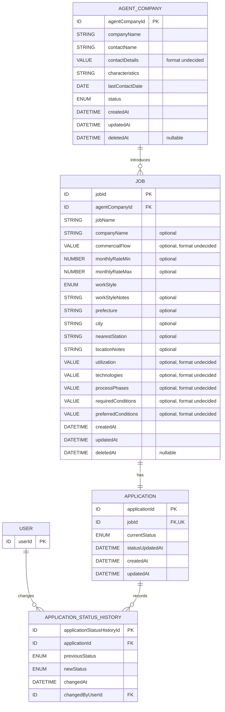

# Sprint 1 論理データモデル

## 1. このドキュメントの目的

本書は、Sprint 1の要求、ユーザーフロー、画面、ワイヤーフレームおよびAPI概要を、実装に必要なデータの責務と関連へ対応付けるための論理データモデルである。

以下を目的とする。

- Sprint 1で必要なエンティティと責務を明確にする
- エンティティ間の関連、カーディナリティおよび参照整合性を整理する
- 登録、更新、論理削除および履歴保持の業務ルールをデータモデルへ反映する
- API、画面およびデータの対応関係を明確にする
- 製品仕様として確定した内容、Developer案、後続の物理設計事項を分離する
- 後続の物理データ設計、実装Issueおよびテスト設計の入力とする

本書は論理データモデルを対象とする。特定のDB製品、ORM、物理テーブル名・カラム名、DB固有の型およびマイグレーション方法は対象外とする。

---

## 2. 対象範囲

### 2.1 対象エンティティ

- User
- AgentCompany
- Job
- Application
- ApplicationStatusHistory

### 2.2 対象外

- 認証サービス内部のユーザー、認証情報およびセッションの物理構造
- ResumeVersion、Interview、ContactLog、NextActionなどSprint 2以降に詳細化するエンティティ
- Applicationの応募日、面談日時、結果、次回アクション、辞退・見送り理由など、Sprint 1で使用しない項目の詳細
- 検索用インデックスの物理構造
- DB固有の制約、トリガー、パーティションおよびストレージ設定
- データ移行、バックアップ、物理削除および復元

Job削除後に将来エンティティであるInterviewやスキルシート関連も保持するという業務ルールは前提として記録するが、本書ではそれらの属性や関連を詳細化しない。

---

## 3. 記載区分

|区分|意味|
|---|---|
|確定事項|要求定義書、決定資料、DESIGN-01〜04およびDESIGN-05のPM回答から確定できる製品仕様|
|Developer案|製品の振る舞いを変更しない範囲で採用する論理データ設計。PRレビュー対象|
|未決事項|製品判断または後続の物理設計が必要で、本書では確定しない事項|

属性名は論理名を英語で表したDeveloper案である。物理テーブル名・カラム名を規定するものではない。

---

## 4. データモデル設計の基本方針

### 4.1 責務を分離する

- Userは、操作した利用者を識別する
- AgentCompanyは、エージェント会社と担当者1名分の情報を管理する
- Jobは、紹介された案件そのものの情報を管理する
- Applicationは、Jobに対する現在の応募・選考状態を管理する
- ApplicationStatusHistoryは、Applicationのステータス変更事実を時系列で保持する

### 4.2 Sprint 1の関係を明示する

- 1件のAgentCompanyは0件以上のJobの紹介元になれる
- 1件のJobは必ず1件のAgentCompanyを紹介元として持つ
- JobとApplicationはSprint 1では1対1とする
- 1件のApplicationは0件以上のApplicationStatusHistoryを持つ
- 1件のUserは0件以上のApplicationStatusHistoryの変更者になれる

### 4.3 現在状態と変更履歴を分離する（Developer案）

Applicationに現在ステータスとその更新日時を保持し、ApplicationStatusHistoryに変更事実を追加する。

これにより、案件一覧・詳細で現在ステータスを都度履歴から集計せず取得でき、履歴は監査用の追記データとして保持できる。現在状態と履歴は、同一トランザクションで整合させる。

### 4.4 論理削除を使用する

- AgentCompanyとJobは削除日時により論理削除状態を表す
- ApplicationとApplicationStatusHistoryはJob削除時も削除しない
- 論理削除済みAgentCompanyとJobは通常の一覧、詳細および検索対象に含めない
- 復元、削除済みデータ専用画面、完全削除はSprint 1の対象外とする

### 4.5 将来拡張を妨げない

Sprint 1では1ユーザー、担当者1名、JobとApplicationの1対1を前提とする。一方で、論理識別子と関連を分け、将来の複数ユーザー、複数担当者、JobとApplicationの1対多への変更を妨げない構成とする。

将来拡張のためだけにSprint 1で未使用のエンティティや属性を追加することはしない。

---

## 5. 論理ER図

図中の`STRING`、`NUMBER`、`DATE`、`DATETIME`、`ENUM`、`ID`は論理形式であり、DB固有の型ではない。`VALUE`は単一値・複数値や内部構造を後続設計で決定する論理的な値を表す。`FK, UK`は、JobとApplicationの1対1を表すために、ApplicationのJob参照が外部参照かつ一意であることを示す。

Userの認証識別子や表示名は未決のためER図へ確定属性として含めず、認証方式決定時に要否を確認する。

---

## 6. エンティティ一覧

|エンティティ|目的・責務|主な関連|Sprint 1での削除|
|---|---|---|---|
|User|ログイン利用者と操作主体を識別する|ApplicationStatusHistoryの変更者|利用者向け削除なし。認証方式決定後に管理方法を確定|
|AgentCompany|エージェント会社と担当者1名分を管理する|0件以上のJobの紹介元|論理削除済みを含む関連Jobがない場合のみ論理削除|
|Job|紹介された案件情報を管理する|1件のAgentCompany、1件のApplication|論理削除。Applicationなどは保持|
|Application|Jobに対する現在の応募・選考状態を管理する|1件のJob、0件以上の履歴|単独削除なし。Job削除後も保持|
|ApplicationStatusHistory|ステータス変更前後、日時、変更者を保持する|1件のApplication、1件のUser|削除・更新を行わない追記データとするDeveloper案|

---

## 7. エンティティ詳細

## 7.1 User

### 目的と責務

事前作成された1ユーザーを識別し、ApplicationStatusHistoryの変更者を表す。

ログイン資格情報をUser内部で保持するか、外部認証基盤に保持するかは未決である。本書のUserは、製品内で利用者を参照するための論理的な主体を表す。

### 主な属性

|論理属性|内容|必須・任意|論理形式|初期値|一意性|区分|
|---|---|---|---|---|---|---|
|`userId`|Userの識別子|必須|ID|生成方式は未決|一意|Developer案|
|`authenticationIdentity`|認証基盤またはログイン情報との対応に使用する識別子候補|未決|文字列またはID|未決|採用する場合は一意候補|未決事項|
|`displayName`|画面表示または履歴上の変更者表示に使用する名称候補|未決|文字列|未決|なし|未決事項|
|`createdAt`|製品内Userを作成した日時|内部保持する場合は必須候補|日時|作成日時|なし|Developer案|
|`updatedAt`|製品内Userを更新した日時|内部保持する場合は必須候補|日時|作成日時|なし|Developer案|

メールアドレス、パスワードハッシュ、認証プロバイダー固有IDなどは、認証方式が未決のため確定属性として記載しない。

### 関連

- User 1件に対し、ApplicationStatusHistoryは0件以上
- 各ApplicationStatusHistoryは、変更者として1件のUserを参照する
- AgentCompanyやJobの所有者としてUserを関連付けるかは、複数ユーザー対応時の未決事項でありSprint 1では追加しない

### 作成・更新・削除方針

- MVPでは認証基盤またはDBへ事前に1ユーザーを作成する
- 利用者向け登録、招待、メール確認、パスワード再設定は提供しない
- Userの更新・削除操作はSprint 1で提供しない
- 初期ユーザーの作成方法は認証設計とREADMEで定義する

### 関連する業務ルール

- Sprint 1は1ユーザー利用とする
- 複数ユーザー間の認可制御は実装しない
- ステータス変更履歴には変更者を保持する

### 後続設計で決定する事項

- Userを製品DBに保持するか、認証基盤のUserを直接参照するか
- 認証情報とUserを対応付ける識別子
- 表示名の要否
- 初期ユーザーの投入方法
- 将来のUser削除時に履歴の変更者参照をどう保持するか

## 7.2 AgentCompany

### 目的と責務

案件の紹介元となるエージェント会社、その担当者1名分、現在のやり取り状態を管理する。

### 主な属性

|論理属性|内容|必須・任意|論理形式|初期値|一意性|区分|
|---|---|---|---|---|---|---|
|`agentCompanyId`|AgentCompanyの識別子|必須|ID|生成方式は未決|一意|Developer案|
|`companyName`|エージェント会社名|必須|文字列|なし|一意性を要求せず重複可|PM承認済み確定事項|
|`contactName`|担当者名|任意|文字列|値なし|なし|PM承認済み確定事項|
|`contactDetails`|連絡先|任意|構造未決|値なし|なし|必須性は確定・形式未決|
|`characteristics`|会社や担当者の特徴|任意|文字列|値なし|なし|PM承認済み確定事項|
|`lastContactDate`|最終連絡日|任意|日付|値なし|なし|PM承認済み確定事項|
|`status`|積極対応中、保留、終了のいずれか|必須|列挙|積極対応中|なし|PM承認済み確定事項|
|`createdAt`|作成日時|必須|日時|作成日時|なし|Developer案|
|`updatedAt`|最終更新日時|必須|日時|作成日時|なし|Developer案|
|`deletedAt`|論理削除日時。未削除時は値なし|任意|日時|値なし|なし|確定事項|

AgentCompanyは会社名と状態を必須とし、その他の登録・編集項目を任意とする。状態の初期値は「積極対応中」とする。会社名の重複を許可し、一意性制約を設けない。連絡先の具体的な保持形式は物理設計で決定する。

### 関連

- AgentCompany 1件に対し、Jobは0件以上
- 各Jobは必ず1件のAgentCompanyを参照する
- 担当者は別エンティティにせず、AgentCompany内に1名分だけ保持する

### 作成・更新・削除方針

- SCR-08から登録し、SCR-09から更新する
- 論理削除済みを含む関連Jobが存在しない場合のみ論理削除できる
- 論理削除済みを含む関連Jobが存在する場合は削除せず、必要に応じて状態を「終了」へ更新する
- 「終了」と論理削除は別の状態として扱う
- 論理削除後は通常の一覧、詳細、検索へ表示しない
- 復元と完全削除はSprint 1で提供しない

### 関連する業務ルール

- 担当者情報は1名分のみ保持する
- 会社名と状態は必須で、その他の登録・編集項目は任意である
- 状態の初期値は「積極対応中」である
- 同じ会社名を持つAgentCompanyを複数登録できる
- 状態は「積極対応中」「保留」「終了」から選択する
- 論理削除済みを含む関連JobがあるAgentCompanyを削除しないことで、紹介元情報と過去の応募履歴を保持する

### 後続設計で決定する事項

- 各登録・編集項目の最大長と物理的なNULL表現
- `contactDetails`を単一文字列、複数項目、構造化値のどれで扱うか
- 状態のAPI値とDB表現

## 7.3 Job

### 目的と責務

AgentCompanyから紹介された案件そのものの情報を管理する。応募・選考状態はApplicationへ分離する。

### 主な属性

|論理属性|内容|必須・任意|論理形式|初期値|一意性|区分|
|---|---|---|---|---|---|---|
|`jobId`|Jobの識別子|必須|ID|生成方式は未決|一意|Developer案|
|`agentCompanyId`|紹介元AgentCompanyへの参照|必須|ID|なし|なし|確定事項|
|`jobName`|案件名|必須|文字列|なし|単独では重複可|確定事項|
|`companyName`|案件元の企業名|任意|文字列|値なし|単独では重複可|確定事項|
|`commercialFlow`|商流|任意|形式未決|値なし|なし|確定項目・形式未決|
|`monthlyRateMin`|月額単価の下限|任意|数値|値なし|なし|確定事項|
|`monthlyRateMax`|月額単価の上限|任意|数値|値なし|なし|確定事項|
|`workStyle`|フルリモート、ハイブリッド、常駐、未確認のいずれか|必須|列挙|初期値なし|なし|PM承認済み確定事項|
|`workStyleNotes`|初日出社、月数回出社などの補足|任意|文字列|値なし|なし|確定事項|
|`prefecture`|勤務地の都道府県|任意|分類値|値なし|なし|確定事項|
|`city`|勤務地の市区町村|任意|文字列|値なし|なし|確定事項|
|`nearestStation`|勤務地の最寄り駅|任意|文字列|値なし|なし|確定事項|
|`locationNotes`|その他の勤務地条件|任意|文字列|値なし|なし|確定事項|
|`utilization`|稼働率|任意|形式未決|値なし|なし|確定項目・形式未決|
|`technologies`|技術|任意|単一・複数、構造とも未決|値なし|なし|確定項目・形式未決|
|`processPhases`|担当工程|任意|単一・複数、構造とも未決|値なし|なし|確定項目・形式未決|
|`requiredConditions`|必須条件|任意|文字列または構造未決|値なし|なし|確定項目・形式未決|
|`preferredConditions`|歓迎条件|任意|文字列または構造未決|値なし|なし|確定項目・形式未決|
|`createdAt`|作成日時|必須|日時|作成日時|なし|Developer案|
|`updatedAt`|最終更新日時|必須|日時|作成日時|なし|Developer案|
|`deletedAt`|論理削除日時。未削除時は値なし|任意|日時|値なし|なし|確定事項|

### 属性間の検証

- `monthlyRateMin`と`monthlyRateMax`は、両方、片方のみ、両方未入力を許可する
- 両方が入力されている場合だけ、`monthlyRateMin`が`monthlyRateMax`以下であることを検証する
- 画面表示単位は万円とするが、DB保存単位と数値形式は確定しない
- 勤務地は1組だけ保持し、複数勤務地はSprint 1の対象外とする
- `workStyle`には初期値を設定せず、情報が不明な場合もユーザーが「未確認」を明示的に選択する

### 関連

- 各Jobは必ず1件のAgentCompanyを参照する
- 各Jobは必ず1件のApplicationを持つ
- Jobの`agentCompanyId`は、未削除で利用可能なAgentCompanyを参照して登録・更新する

### 作成・更新・削除方針

- Job作成時にApplicationを同一トランザクションで1件自動作成する
- Job作成だけ、またはApplication作成だけが保存された状態を正常完了としない
- Job更新ではApplicationの現在ステータスを更新しない
- 紹介元AgentCompanyを変更した場合も、Sprint 1では変更前の紹介元を専用履歴として保持しない
- Jobは論理削除し、削除日時を保持する
- Job削除後もApplicationとApplicationStatusHistoryを保持する
- 削除済みJobは通常の一覧、詳細、検索へ表示しない
- 復元と完全削除はSprint 1で提供しない

### 関連する業務ルール

- 案件名、紹介元AgentCompany、勤務形態は必須である
- 企業名などの任意項目は、判明後に編集できる
- ApplicationはJob登録時に必ず作成する
- 企業名が未入力の場合、将来の重複判定精度が下がることは既知の制約である

### 後続設計で決定する事項

- 各属性の最大長、NULL可否およびDB固有の型
- 単価のDB保存単位、精度およびAPI返却単位
- `commercialFlow`、`utilization`、`technologies`、`processPhases`、条件欄の物理表現
- 都道府県のコード体系
- 更新競合と二重送信への対策

## 7.4 Application

### 目的と責務

1件のJobに対する現在の応募・選考状態を管理する。Jobの案件情報とは責務を分離する。

### 主な属性

|論理属性|内容|必須・任意|論理形式|初期値|一意性|区分|
|---|---|---|---|---|---|---|
|`applicationId`|Applicationの識別子|必須|ID|生成方式は未決|一意|Developer案|
|`jobId`|Jobへの参照|必須|ID|Job作成時のID|一意|確定関係・Developer制約案|
|`currentStatus`|現在の応募・選考ステータス|必須|列挙|未応募|なし|確定事項|
|`statusUpdatedAt`|現在ステータスを設定または更新した日時|必須|日時|Application作成日時|なし|Developer案|
|`createdAt`|作成日時|必須|日時|作成日時|なし|Developer案|
|`updatedAt`|最終更新日時|必須|日時|作成日時|なし|Developer案|

`jobId`を一意にすることは、Sprint 1のJobとApplicationの1対1をデータ上で保証するDeveloper案である。

### ステータス

以下の値を管理する。

- 未応募
- 提案中
- 応募済み
- 書類確認
- 面談予定
- 結果待ち
- 参画決定
- 辞退
- 見送り

現在のステータスに関係なく、定義済みの全ステータスへ変更できる。遷移順の制約は設けない。

### 関連

- 各Applicationは必ず1件のJobを参照する
- 各Applicationは0件以上のApplicationStatusHistoryを持つ
- 同一Jobに複数のApplicationを作成しない

### 作成・更新・削除方針

- Job作成と同時に自動作成し、初期ステータスを「未応募」とする
- Application単独の登録、編集、削除操作は提供しない
- 現在ステータスだけをApplicationステータス更新APIから更新する
- Job削除後もApplicationを削除しない
- 削除済みJobに紐付くApplicationを通常画面から直接参照する機能は提供しない

### 関連する業務ルール

- JobとApplicationはSprint 1で1対1である
- 現在と同じステータスを指定した場合は更新しない
- 同一ステータス指定時は`statusUpdatedAt`、`updatedAt`および履歴を変更しない
- ステータス、ステータス更新日時および履歴は一貫して更新する

### 後続設計で決定する事項

- 列挙値の物理表現
- `statusUpdatedAt`と一般の`updatedAt`の厳密な更新規則
- 応募日などSprint 2以降で使用する属性の追加時期
- 将来1対多へ変更する場合の一意性制約移行方法

## 7.5 ApplicationStatusHistory

### 目的と責務

Applicationのステータス変更前後、変更日時、変更者を時系列で保持する。

### 主な属性

|論理属性|内容|必須・任意|論理形式|初期値|一意性|区分|
|---|---|---|---|---|---|---|
|`applicationStatusHistoryId`|履歴の識別子|必須|ID|生成方式は未決|一意|Developer案|
|`applicationId`|対象Applicationへの参照|必須|ID|なし|なし|確定事項|
|`previousStatus`|変更前ステータス|必須|列挙|なし|なし|PM承認済み確定事項|
|`newStatus`|変更後ステータス|必須|列挙|なし|なし|確定事項|
|`changedAt`|変更日時|必須|日時|変更日時|なし|確定事項|
|`changedByUserId`|変更者Userへの参照|必須|ID|認証中のUser|なし|確定事項|

Application作成時は初期履歴を作成しない。ApplicationStatusHistoryは「未応募」から別のステータスへ初めて変更した時点から追加するため、すべての履歴で`previousStatus`を必須とする。

### 関連

- 各ApplicationStatusHistoryは必ず1件のApplicationを参照する
- 各ApplicationStatusHistoryは必ず1件のUserを変更者として参照する
- Application 1件に対して履歴は0件以上存在する

### 作成・更新・削除方針

- Application作成時には追加せず、現在とは異なる定義済みステータスへの変更成功時に1件追加する
- Applicationの現在状態、更新日時、履歴を同一トランザクションで更新する
- 現在と同じステータスが指定された場合は履歴を追加しない
- 履歴は過去の変更事実であるため、更新・削除しない追記専用データとするDeveloper案
- Jobを論理削除しても履歴を保持する

### 関連する業務ルール

- 変更前ステータス、変更後ステータス、変更日時、変更者を保持する
- ステータス更新と履歴保存の一方だけを正常完了としない
- 履歴表示機能はSprint 4対象だが、履歴記録はSprint 1から行う

### 後続設計で決定する事項

- 履歴IDの生成方式
- 履歴の物理的な不変性を保証する方法
- Userを外部認証基盤で管理する場合の変更者参照方法
- 同時更新時の競合検出方法

---

## 8. エンティティ間のカーディナリティと整合性

|関連|カーディナリティ|必須性|参照整合性・削除方針|
|---|---|---|---|
|AgentCompany－Job|1対0以上|Job側はAgentCompany必須|Job登録・更新時は有効なAgentCompanyを参照する。論理削除済みを含む関連JobがあるAgentCompanyは削除不可|
|Job－Application|1対1|双方必須|Job登録とApplication作成を一体で行う。Applicationの`jobId`を一意にするDeveloper案|
|Application－ApplicationStatusHistory|1対0以上|履歴側はApplication必須|Applicationと履歴を物理削除しない。履歴からApplicationへの参照を保持|
|User－ApplicationStatusHistory|1対0以上|履歴側は変更者必須|認証中Userを変更者として保持。将来のUser削除時の扱いは後続設計|

物理外部キーの制約名や`ON DELETE`動作はDB選定後に決定する。論理上は、親の削除を理由にApplicationまたは履歴を連鎖削除しない。

---

## 9. ID、日付、日時の表現方針

### 9.1 ID（Developer案）

- 各エンティティは単一の論理IDを持つ
- APIには構造を解釈しない不透明な文字列として公開する
- UUID、連番などの生成方式は物理設計で決定する
- 業務上の名称を主キーとして使用しない
- 外部参照は参照先の論理IDを使用する

### 9.2 日付と日時（Developer案）

- 日付だけを表す最終連絡日は日付形式とする
- 作成、更新、削除、ステータス変更など時点を表す値は日時形式とする
- APIではタイムゾーン付きISO 8601、UTCを基本とする
- DBのタイムゾーン設定と物理型は物理設計で決定する
- 表示時にクライアントが日本時間へ変換する

### 9.3 作成・更新・削除日時

|属性|方針|
|---|---|
|`createdAt`|レコード作成時に設定し、通常は変更しないDeveloper案|
|`updatedAt`|更新を伴う正常処理で更新するDeveloper案。同一ステータス指定のno-opでは更新しない|
|`deletedAt`|AgentCompanyとJobの論理削除成功時に設定する確定事項。未削除時は値なし|
|`statusUpdatedAt`|Applicationの現在ステータスを設定・変更した時点を表すDeveloper案。同一ステータスでは変更しない|
|`changedAt`|ApplicationStatusHistoryの変更事実が発生した時点。作成後は変更しない|

---

## 10. 論理削除方針

|エンティティ|論理削除|削除条件|削除後の扱い|
|---|---|---|---|
|User|Sprint 1対象外|なし|将来のUser管理と履歴参照を考慮して後続設計|
|AgentCompany|行う|論理削除済みを含む関連Jobが存在しないこと|通常一覧・詳細・検索から除外。復元・完全削除なし|
|Job|行う|ユーザーが削除を確定したこと|通常一覧・詳細・検索から除外。Applicationと履歴は保持|
|Application|行わない|単独削除操作なし|Job削除後も保持し、通常画面から直接参照しない|
|ApplicationStatusHistory|行わない|削除操作なし|Job削除後も保持|

### 10.1 AgentCompany削除時

AgentCompany削除処理では、論理削除済みを含む関連Jobの存在確認と`deletedAt`の設定を一つの整合性のある処理として行う。確認後に別処理でJobが作成される競合を防ぐ具体的方法は物理設計で決定する。

### 10.2 Job削除時

Jobの`deletedAt`だけを設定し、ApplicationとApplicationStatusHistoryへ削除状態を伝播しない。将来関連するInterviewやスキルシート関連も保持する。

---

## 11. 一意性制約と参照整合性

### 11.1 論理的に必要な制約

|対象|制約|根拠|
|---|---|---|
|全エンティティのID|各エンティティ内で一意|レコードを安定して識別するため|
|AgentCompany.`companyName`|一意性を要求しない|同名のAgentCompany登録を許可するPM承認事項のため|
|Application.`jobId`|一意|Sprint 1のJobとApplicationの1対1を保証するため|
|Job.`agentCompanyId`|有効なAgentCompanyを参照|紹介元を必須とするため|
|Application.`jobId`|有効なJobを参照|JobなしのApplicationを作らないため|
|ApplicationStatusHistory.`applicationId`|有効なApplicationを参照|履歴対象を失わないため|
|ApplicationStatusHistory.`changedByUserId`|有効なUserを参照|変更者を保持するため|

### 11.2 Developer案としての検証制約

- AgentCompanyの状態は定義済み3値だけを受け付ける
- Jobの勤務形態は定義済み4値だけを受け付ける
- Applicationと履歴のステータスは定義済み9値だけを受け付ける
- 単価下限と上限の両方がある場合、下限が上限以下であることを保証する
- 同一ステータスへの更新ではApplicationと履歴へ書き込みを行わない

これらをDB制約、アプリケーション検証、または両方で保証するかは物理設計で決定する。

### 11.3 一意性を設定しない、または確定しない項目

- Userの認証識別子
- AgentCompanyの会社名は重複を許可し、一意性制約を設定しない
- AgentCompanyの連絡先
- Jobの案件名
- Jobの企業名と案件名の組み合わせ

重複候補の警告と、登録を禁止する一意性制約は異なる。既存要求はJobの重複候補を警告する方針であり、同名Jobの登録禁止を意味しない。

---

## 12. トランザクション境界

|処理|同一処理単位に含める変更|失敗時の方針|
|---|---|---|
|Job登録|Job作成、初期ステータス「未応募」のApplication作成。初期ApplicationStatusHistoryは作成しない|すべて取り消し、一方だけを残さない|
|Applicationステータス更新|現在ステータス更新、`statusUpdatedAt`更新、`updatedAt`更新、ApplicationStatusHistory追加|すべて取り消し、現在状態と履歴を不一致にしない|
|同一ステータス指定|書き込みなし|更新日時と履歴を変更しない|
|AgentCompany削除|論理削除済みを含む関連Job存在確認、削除可否判定、`deletedAt`設定|関連Jobがあれば削除しない。競合で条件が変わった場合も削除しない|
|Job削除|Jobの`deletedAt`設定|失敗時は未削除のままとし、Applicationと履歴は変更しない|

分離レベル、ロック、ORMのトランザクションAPI、再試行および冪等性の具体的方法は後続の物理設計・実装で決定する。

---

## 13. インデックス候補（Developer案）

以下はSprint 1の取得・整合性確認を支援する論理的な候補であり、物理インデックスを確定するものではない。

|対象属性|目的|確定時に確認すること|
|---|---|---|
|各エンティティのID|主キー検索|DBとID生成方式|
|Application.`jobId`|1対1の一意性保証、JobからApplication取得|一意制約と外部キーの実装|
|Job.`agentCompanyId`|AgentCompanyの関連Job表示、論理削除済みを含む削除可否確認|Jobの削除状態にかかわらず関連を効率よく確認できる構成|
|Job.`deletedAt`|通常一覧から削除済みJobを除外|DBごとのNULL検索特性、一覧ソートとの複合化|
|AgentCompany.`deletedAt`|通常一覧から削除済み会社を除外|一覧ソートとの複合化|
|Job.`createdAt`|Job一覧を作成日時の降順で取得|`deletedAt`などとの複合化と物理的な並び順|
|AgentCompany.`createdAt`|AgentCompany一覧を作成日時の降順で取得|`deletedAt`などとの複合化と物理的な並び順|
|ApplicationStatusHistory.`applicationId`, `changedAt`|Application単位の履歴を時系列取得|履歴表示はSprint 4である点、並び順|
|ApplicationStatusHistory.`changedByUserId`|変更者による監査・追跡|Sprint 1で検索用途がないため作成時期|

案件100件を通常データ量とするため、すべての候補を先に作成するのではなく、実際のクエリ、実行計画、更新コストを確認して物理設計で選択する。

Sprint 1ではJobとAgentCompanyの検索・絞り込みを実装しないため、案件名、企業名、技術、Applicationステータスなどの検索・絞り込み用インデックスは作成候補に含めない。Sprint 2の検索設計時に改めて検討する。

JobとAgentCompanyの一覧は`createdAt`の降順とするが、インデックスの物理構成や複合順序は後続の物理設計で決定する。

---

## 14. 画面・API・エンティティ対応表

|画面・UI|主なAPI|読み書きするエンティティ|
|---|---|---|
|SCR-01 ログイン|AUTH-01|Userまたは認証基盤。物理的な保持先は未決|
|SCR-02 案件一覧|JOB-01、APP-01候補、APP-02、AUTH-02|Job、AgentCompany、Application。更新時はApplicationStatusHistory、User|
|SCR-03 案件詳細|JOB-02、APP-01候補、APP-02、JOB-05、AUTH-02|Job、AgentCompany、Application。更新時はApplicationStatusHistory、User|
|SCR-04 案件登録|AC-01、JOB-03、AUTH-02|AgentCompany参照、Job作成、Application自動作成|
|SCR-05 案件編集|JOB-02、AC-01、JOB-04、AUTH-02|Job、AgentCompany、Application概要|
|SCR-06 AgentCompany一覧|AC-01、AUTH-02|AgentCompany|
|SCR-07 AgentCompany詳細|AC-02、AC-05、AUTH-02|AgentCompany、関連Job|
|SCR-08 AgentCompany登録|AC-03、AUTH-02|AgentCompany|
|SCR-09 AgentCompany編集|AC-02、AC-04、AUTH-02|AgentCompany|
|UI-01 応募ステータス選択|APP-02|Application、ApplicationStatusHistory、User|
|UI-02 Job削除確認|JOB-05|Job。Applicationと履歴は変更しない|
|UI-03 AgentCompany削除確認|AC-05|AgentCompany、削除可否確認用Job|
|UI-04 AgentCompany削除不可案内|AC-05の競合結果、AC-04|Job存在確認、AgentCompany状態更新|
|UI-05 ログアウト|AUTH-02|Userまたは認証状態。具体的な保持先は未決|

---

## 15. 採用した主要な技術判断と理由

|論点|採用案|区分|理由|
|---|---|---|---|
|現在ステータス|Applicationに保持する|Developer案|案件一覧・詳細で履歴集計なしに取得できる|
|ステータス履歴|ApplicationStatusHistoryへ追記する|確定事項＋Developer構造案|変更前後、日時、変更者を保持し、現在状態と責務を分けられる|
|Job/Applicationの1対1|ApplicationのJob参照を一意にする|Developer案|確定済みの1対1をデータ上でも保証できる|
|担当者|AgentCompany内に1名分を埋め込む|確定事項|Sprint 1では複数担当者管理が対象外である|
|AgentCompany名|重複を許可し一意性制約を設けない|PM承認済み確定事項|同名会社を業務上区別して登録できるようにする|
|勤務地|Job内に1組の論理属性として保持する|確定事項＋Developer構造案|複数勤務地が対象外で、独立ライフサイクルがない|
|論理削除|削除日時で表す|確定事項|削除日時の保持が要求され、未削除と削除時点を一つの属性で表せる|
|履歴の保持|更新・削除しない追記データとする|Developer案|過去の変更事実を後から書き換えないため|
|ID|業務項目と分離した不透明な論理ID|Developer案|名称変更やDB方式から参照を独立させられる|
|Job登録|Application作成と同一トランザクション|確定業務ルール＋Developer実現案|一方だけが保存される状態を防ぐ|

---

## 16. 代表的な代替案との比較

|論点|採用案|代表的な代替案|違い|
|---|---|---|---|
|現在ステータス|Applicationに現在値を持ち、履歴も保持|履歴の最新行から毎回算出|算出方式は重複を避けられるが、一覧取得と同時更新制御が複雑になる|
|Job/Application|別エンティティの1対1|Jobへステータスを直接保持|直接保持は単純だが、応募・選考の責務と将来の1対多拡張が弱くなる|
|1対1の保証|ApplicationのJob参照を一意にする|アプリケーションコードだけで保証|コードだけの方式は移行しやすいが、競合時に複数Applicationを防ぎにくい|
|担当者|AgentCompanyへ1名分を埋め込む|ContactPersonを別エンティティ化|別エンティティは複数担当者に強いが、Sprint 1では未使用の管理が増える|
|勤務地|Job内の1組の属性|Locationを別エンティティ化|別エンティティは複数勤務地に適するが、Sprint 1では過剰になる|
|論理削除|`deletedAt`を保持|削除フラグだけを保持|フラグは単純だが、要求される削除日時を別途保持する必要がある|
|履歴|変更ごとに1行を追記|Applicationに変更履歴全体を構造化して保持|構造化値は読み出しが簡単な場合もあるが、参照整合性、検索、追記制御が弱くなる|
|Application初期状態|Applicationだけに「未応募」を設定し、初期履歴は作らない|作成時にも履歴を1件作る|採用案では履歴を実際の変更に限定でき、`previousStatus`を常に必須にできる|
|ステータス表現|論理列挙として定義し、物理表現は後続決定|自由入力文字列|自由入力は拡張しやすいが、未定義値を防ぎにくい|
|技術・工程など|論理項目だけ定義し物理表現を保留|この段階で別エンティティまたは配列へ固定|Sprint 2の検索詳細が未設計の段階で固定すると、不要な複雑さや変更を生む|

---

## 17. 既存資料およびDESIGN-05のPM回答から確定できる内容

### 17.1 User

- 認証基盤またはDBへ事前作成した1ユーザーのみがログインする
- 利用者向けユーザー登録、招待、メール確認、パスワード再設定はSprint 1対象外である
- ステータス変更履歴に変更者を保持する

### 17.2 AgentCompany

- 会社名、担当者名、連絡先、特徴、最終連絡日、状態を管理する
- 会社名と状態は必須で、その他の登録・編集項目は任意である
- 状態の初期値は「積極対応中」である
- 会社名の重複を許可し、一意性制約を設けない
- 状態は「積極対応中」「保留」「終了」である
- 担当者情報はAgentCompany内に1名分だけ保持する
- 論理削除済みを含む関連Jobが存在するAgentCompanyは削除できない
- 論理削除済みを含む関連Jobが存在しないAgentCompanyは論理削除できる
- 「終了」と論理削除は異なる

### 17.3 Job

- 案件名、紹介元AgentCompany、勤務形態は必須である
- 勤務形態には初期値を設定せず、ユーザーが明示的に選択する
- 企業名、商流、単価、勤務地、稼働率、技術、担当工程、必須条件、歓迎条件は任意である
- 単価は下限・上限をそれぞれ数値で保持する
- 勤務形態は定義済み4値から選択する
- 勤務地は都道府県と任意の補足項目を1組保持する
- Jobは論理削除し、通常一覧と検索へ表示しない
- Job削除後もApplicationと履歴を保持する
- 紹介元AgentCompanyの変更履歴はSprint 1では保持しない

### 17.4 Applicationと履歴

- JobとApplicationはSprint 1で1対1である
- Job登録時に初期ステータス「未応募」のApplicationを自動作成する
- Application作成時はApplicationStatusHistoryを作成しない
- ApplicationStatusHistoryは最初のステータス変更から記録し、`previousStatus`を必須とする
- JobとApplicationの一方だけを保存しない
- Application単独の登録、編集、削除機能は設けない
- 現在のステータスに関係なく定義済みの全ステータスへ変更できる
- 同一ステータス指定時は更新日時と履歴を変更しない
- ステータス変更時は変更前後、変更日時、変更者を保持する
- ステータス更新と履歴保存の一方だけを正常完了としない

---

## 18. DESIGN-05でPM承認された製品判断

DESIGN-04・05で未決事項として整理した内容について、Developer案がPM承認された。Sprint 1の論理データモデルでは以下を確定事項として扱う。

1. AgentCompanyは会社名と状態を必須とし、その他の登録・編集項目を任意とする
2. AgentCompany登録時の状態初期値は「積極対応中」とする
3. AgentCompanyの会社名重複を許可し、一意性制約を設けない
4. 論理削除済みJobもAgentCompanyの関連Job判定へ含める
5. Sprint 1ではJobの検索・絞り込みを実装しない
6. Sprint 1ではAgentCompany検索を実装しない
7. Job、AgentCompanyの一覧は`createdAt`の降順とする
8. Sprint 1では紹介元AgentCompany変更履歴を保持しない
9. Job登録時の勤務形態には初期値を設定せず、ユーザーが明示的に選択する
10. Application作成時はApplicationStatusHistoryを作成せず、最初のステータス変更から履歴を記録する

これにより、本書作成時に挙げたSprint 1の製品判断事項は解消した。物理的なデータ型、保存形式、制約の実現方法などは引き続き後続設計で決定する。

---

## 19. 後続の物理設計で決定する内容

### 19.1 認証・User

- Userを製品DBへ保持するか、認証基盤のUserを直接参照するか
- 認証主体とUserの対応方法
- 初期ユーザーの作成方法
- 認証情報、セッション、Cookieまたはトークンの保存方法

### 19.2 物理スキーマ

- DB製品、ORM、マイグレーションツール
- 物理テーブル名、物理カラム名
- 主キーと外部キーの型・制約名
- ID生成方式
- 文字列長、NULL可否、デフォルト値
- 列挙値をDB制約、参照テーブル、文字列のどれで表すか
- 作成・更新日時の自動設定方法
- 外部キーの`ON DELETE`・`ON UPDATE`動作

### 19.3 Job属性

- DB上の単価保存単位、精度、スケール
- 稼働率の型と許容範囲
- 技術、担当工程、必須条件、歓迎条件の物理表現
- 都道府県のコード体系
- 検索用の正規化項目とインデックス

### 19.4 整合性と性能

- トランザクション分離レベルとロック方法
- 同時更新の競合検出方式
- 二重送信と冪等性への対応
- 論理削除を考慮した一意性とインデックス
- 一覧・検索クエリに合わせた複合インデックス
- AgentCompany削除判定とJob作成の競合防止
- 履歴データの増加を考慮した保持・検索方法

### 19.5 Sprint 2以降

- Applicationの応募日、面談、結果、次回アクションなどの追加時期と責務分割
- ResumeVersion、Interview、ContactLog、NextActionとの関連
- JobとApplicationを1対多へ変更する場合の移行方法
- 複数担当者を別エンティティ化する場合の移行方法
- 複数ユーザー間の所有権と認可モデル

---

## 20. 関連資料

- [Agent Job Tracker 要求定義書](../requirements/revised-product-requirements.md)
- [初期資料で明示された実装前論点](../requirements/explicit-decision-points.md)
- [Developerが追加で発見した確認事項](../requirements/developer-raised-questions.md)
- [Sprint 1 ユースケース・ユーザーフロー](sprint1-user-flows.md)
- [Sprint 1 画面一覧](sprint1-screen-list.md)
- [Sprint 1 画面遷移](sprint1-screen-transitions.md)
- [Sprint 1 ワイヤーフレーム](sprint1-wireframes.md)
- [Sprint 1 API一覧・入出力概要](sprint1-api-overview.md)
