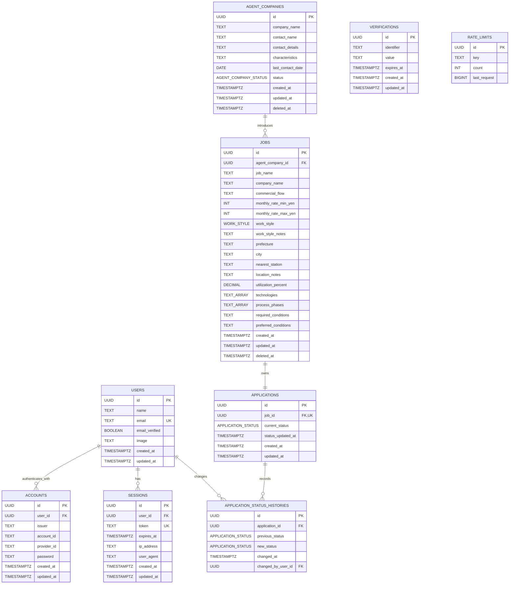

# Sprint 1 物理データモデル

## 1. 文書情報

|項目|内容|
|---|---|
|対応Issue|DESIGN-07|
|対象|Agent Job Tracker Sprint 1|
|DB|PostgreSQL 18|
|ORM・Migration|Prisma ORM 7|
|目的|論理データモデルと認証設計を、Prisma schema・Migration・seedへ実装できる物理データ設計へ変換する|
|位置付け|物理データ設計。実際のPrisma schema、Migrationおよびseedは後続の環境構築Issueで作成する|

本書は、DESIGN-05の論理モデル、TECH-01の技術構成およびDESIGN-06の認証設計を入力とする。

既存資料から確定できる製品要件、Developerが採用する物理実現案、PRでPMレビューを受ける製品データ上の判断、後続の入力・エラー設計および実装事項を区別する。

---

## 2. 対象範囲

### 2.1 対象

- AgentCompany、Job、Application、ApplicationStatusHistoryの物理モデル
- Better AuthのUser、Account、Session、VerificationおよびRateLimitとの対応
- テーブル、カラム、型、主キー、外部キー、一意性制約、CHECK制約およびインデックス
- ID、日付、日時、列挙値、単価、稼働率および複数値項目の物理表現
- 論理削除、履歴保持、トランザクションおよび競合制御
- Migration、seedおよび初期User bootstrapへの引き渡し

### 2.2 対象外

- `prisma/schema.prisma`、Migration SQLおよびseed codeの実装
- Docker ComposeとPostgreSQL環境の構築
- APIの最終request・response schema
- 文字列項目の製品上の最大入力長
- 空文字、前後空白、正規化および最終error message
- Repository、Application ServiceおよびRoute Handlerの実装
- 本番DB事業者、backup、監視および長期保管の選定
- Sprint 2以降のエンティティと検索用正規化

---

## 3. 決定区分

|区分|意味|
|---|---|
|確定要件|要求定義書またはDESIGN-01〜06でPM承認済みの製品仕様|
|Developer採用案|採用DB・ORMと一般的な整合性設計に基づく物理実現。PRでPMレビューを受ける|
|PMレビュー対象|保存値や将来のdata移行へ影響し、既存資料だけでは一意に決まらない案|
|後続設計事項|入力・error詳細設計または環境構築・実装で確定、検証する事項|

---

## 4. 既存資料から確定できる内容

- Better AuthのUser recordを論理Userとして直接使用し、業務用Userを重複作成しない
- MVPでは事前作成した1Userのみを使用し、public sign-upを提供しない
- AgentCompanyは会社名と状態が必須で、状態の初期値は「積極対応中」である
- AgentCompanyの会社名は重複可能で、一意性を要求しない
- AgentCompanyは担当者情報を1名分だけ保持する
- Jobは案件名、紹介元AgentCompanyおよび勤務形態が必須である
- Jobの勤務形態には初期値を設定しない
- JobとApplicationは1対1で、Job作成時に「未応募」のApplicationを同時作成する
- JobとApplicationの一方だけを保存した状態にしない
- JobとAgentCompanyは論理削除し、通常取得から除外する
- Job削除後もApplicationとApplicationStatusHistoryを保持する
- 論理削除済みを含むJobが1件でもあればAgentCompanyを削除できない
- Application作成時は履歴を作成せず、最初のステータス変更から履歴を追加する
- 履歴には変更前、変更後、変更日時および認証中Userを必須で保持する
- 同じステータスへの変更ではApplication、更新日時および履歴を変更しない
- JobとAgentCompanyの一覧は作成日時の降順である
- Sprint 1ではJob・AgentCompanyの検索と絞り込みを実装しない

---

## 5. 物理設計の基本方針

1. Prisma schemaを通常のモデル定義の原本とし、Prismaで表せないDB制約だけMigration SQLで補う
2. テーブル名とカラム名はPostgreSQL側で複数形の`snake_case`、Prisma側で単数形の`PascalCase`と`camelCase`を使用する
3. すべての主キーはPostgreSQL 18が生成するUUID v7とし、APIでは内部構造を解釈しない文字列として扱う
4. 時点は`timestamp with time zone`、日付だけの値は`date`で保持する
5. 状態値はPrisma enumとPostgreSQL enumで制限し、表示用日本語をDBへ保存しない
6. DBで保証できる行内条件、参照整合性および一意性はDB制約でも保証する
7. 行をまたぐ業務条件はApplication Serviceのtransactionとrow lockで保証する
8. 論理削除対象を物理削除せず、履歴を親削除へ連鎖させない
9. 認証schemaは固定したBetter Auth versionから生成し、本書との差分を確認してからPrisma Migrationへ含める
10. Sprint 1で使うqueryを優先し、将来検索だけを目的としたtable・indexを先に追加しない

---

## 6. 命名規則

|対象|規則|例|
|---|---|---|
|Prisma model|単数形`PascalCase`|`AgentCompany`|
|Prisma field|`camelCase`|`agentCompanyId`|
|PostgreSQL table|複数形`snake_case`|`agent_companies`|
|PostgreSQL column|`snake_case`|`agent_company_id`|
|主キー制約|`<table>_pkey`|`jobs_pkey`|
|外部キー制約|`<table>_<column>_fkey`|`jobs_agent_company_id_fkey`|
|一意性制約|`<table>_<columns>_key`|`applications_job_id_key`|
|CHECK制約|`<table>_<condition>_check`|`jobs_monthly_rate_range_check`|
|通常index|`<table>_<columns>_idx`|`jobs_agent_company_id_idx`|

Prismaでは`@@map`と`@map`を使用し、application codeの名前とDB名を分離する。Better Auth側にも同じtable・field mappingを設定し、libraryの論理field名は変更しない。

---

## 7. ID、日付、日時

### 7.1 ID

|項目|採用案|
|---|---|
|PostgreSQL型|`uuid`|
|Prisma型|`String @db.Uuid`|
|DB default|`uuidv7()`|
|Prisma default表現候補|`@default(dbgenerated("uuidv7()"))`|
|Better Auth|`advanced.database.generateId: false`としてDB defaultへ委譲|
|API表現|不透明な文字列|

UUID v7は時刻順に近い値となり、連番を外部へ公開せず、複数環境でも中央採番なしに生成できる。ID順を業務上の作成順としては使用せず、必ず`createdAt`とIDの組み合わせで安定sortする。

後続のMigrationでPostgreSQL 18の`uuidv7()`がdefaultとして生成されること、Prisma ClientとBetter Auth Prisma adapterがUUIDを文字列として扱えることをintegration testで確認する。

### 7.2 日付と日時

|論理値|PostgreSQL|Prisma|方針|
|---|---|---|---|
|日付|`date`|`DateTime @db.Date`|`lastContactDate`だけに使用|
|時点|`timestamptz(3)`|`DateTime @db.Timestamptz(3)`|作成・更新・削除・status変更・期限に使用|
|RateLimit時刻|`bigint`|`BigInt @db.BigInt`|Better Auth仕様どおりepoch millisecond|

- DB sessionのtimezoneはUTCとする
- APIはtimezone付きISO 8601で返す
- 日本時間への変換はpresentationで行う
- `createdAt`はDBの`now()`で初期化し、通常更新しない
- `updatedAt`は作成時を`now()`とし、正常な更新でPrismaの`@updatedAt`または同じ明示時刻を設定する
- 同一statusのno-opでは`updatedAt`と`statusUpdatedAt`を更新しない
- Application更新時刻とHistory変更時刻には、同一transaction内で生成した同じ時刻を使用する

---

## 8. 列挙値

### 8.1 AgentCompanyStatus

|DB・API内部値|表示|
|---|---|
|`ACTIVE`|積極対応中|
|`ON_HOLD`|保留|
|`ENDED`|終了|

### 8.2 WorkStyle

|DB・API内部値|表示|
|---|---|
|`FULL_REMOTE`|フルリモート|
|`HYBRID`|ハイブリッド|
|`ONSITE`|常駐|
|`UNKNOWN`|未確認|

### 8.3 ApplicationStatus

|DB・API内部値|表示|
|---|---|
|`NOT_APPLIED`|未応募|
|`PROPOSING`|提案中|
|`APPLIED`|応募済み|
|`DOCUMENT_REVIEW`|書類確認|
|`INTERVIEW_SCHEDULED`|面談予定|
|`AWAITING_RESULT`|結果待ち|
|`ENGAGEMENT_CONFIRMED`|参画決定|
|`WITHDRAWN`|辞退|
|`REJECTED`|見送り|

PostgreSQL enumは未定義値をDBでも拒否でき、Prisma Clientで型を得られるため採用する。値の追加はMigrationで行い、削除・名称変更は既存data移行を伴う変更として扱う。

---

## 9. 物理ER図



`Verification`と`RateLimit`はUserへの直接外部keyを持たないBetter Auth管理dataである。図では業務relationとauth relationだけを線で示す。

---

## 10. 業務モデル詳細

### 10.1 AgentCompany / `agent_companies`

|Prisma field|DB column|PostgreSQL / Prisma|NULL・default|制約・補足|
|---|---|---|---|---|
|`id`|`id`|`uuid` / `String @db.Uuid`|NOT NULL / `uuidv7()`|PK|
|`companyName`|`company_name`|`text` / `String`|NOT NULL|重複可|
|`contactName`|`contact_name`|`text` / `String?`|NULL|担当者1名分|
|`contactDetails`|`contact_details`|`text` / `String?`|NULL|電話・Email等をSprint 1では1つの自由記述として保持|
|`characteristics`|`characteristics`|`text` / `String?`|NULL|自由記述|
|`lastContactDate`|`last_contact_date`|`date` / `DateTime? @db.Date`|NULL|時刻を持たない|
|`status`|`status`|`agent_company_status` / `AgentCompanyStatus`|NOT NULL / `ACTIVE`|3値|
|`createdAt`|`created_at`|`timestamptz(3)` / `DateTime`|NOT NULL / `now()`|通常不変|
|`updatedAt`|`updated_at`|`timestamptz(3)` / `DateTime`|NOT NULL / `now()`|正常更新時だけ変更|
|`deletedAt`|`deleted_at`|`timestamptz(3)` / `DateTime?`|NULL|NULLが未削除|

`companyName`に一意性制約を設けない。`status = ENDED`と`deletedAt IS NOT NULL`は別概念であり、相互に自動変換しない。

### 10.2 Job / `jobs`

|Prisma field|DB column|PostgreSQL / Prisma|NULL・default|制約・補足|
|---|---|---|---|---|
|`id`|`id`|`uuid` / `String @db.Uuid`|NOT NULL / `uuidv7()`|PK|
|`agentCompanyId`|`agent_company_id`|`uuid` / `String @db.Uuid`|NOT NULL|FK、物理削除RESTRICT|
|`jobName`|`job_name`|`text` / `String`|NOT NULL|重複可|
|`companyName`|`company_name`|`text` / `String?`|NULL|案件元企業名|
|`commercialFlow`|`commercial_flow`|`text` / `String?`|NULL|自由記述|
|`monthlyRateMinYen`|`monthly_rate_min_yen`|`integer` / `Int?`|NULL|0以上の円単位整数|
|`monthlyRateMaxYen`|`monthly_rate_max_yen`|`integer` / `Int?`|NULL|0以上の円単位整数|
|`workStyle`|`work_style`|`work_style` / `WorkStyle`|NOT NULL / defaultなし|明示選択必須|
|`workStyleNotes`|`work_style_notes`|`text` / `String?`|NULL|自由記述|
|`prefecture`|`prefecture`|`text` / `String?`|NULL|都道府県の日本語名称|
|`city`|`city`|`text` / `String?`|NULL|市区町村|
|`nearestStation`|`nearest_station`|`text` / `String?`|NULL|最寄り駅|
|`locationNotes`|`location_notes`|`text` / `String?`|NULL|勤務地補足|
|`utilizationPercent`|`utilization_percent`|`numeric(5,2)` / `Decimal? @db.Decimal(5,2)`|NULL|0以上100以下の百分率|
|`technologies`|`technologies`|`text[]` / `String[]`|NOT NULL / `{}`|順序付きの0件以上|
|`processPhases`|`process_phases`|`text[]` / `String[]`|NOT NULL / `{}`|順序付きの0件以上|
|`requiredConditions`|`required_conditions`|`text` / `String?`|NULL|長文を1項目で保持|
|`preferredConditions`|`preferred_conditions`|`text` / `String?`|NULL|長文を1項目で保持|
|`createdAt`|`created_at`|`timestamptz(3)` / `DateTime`|NOT NULL / `now()`|一覧sort|
|`updatedAt`|`updated_at`|`timestamptz(3)` / `DateTime`|NOT NULL / `now()`|正常更新時だけ変更|
|`deletedAt`|`deleted_at`|`timestamptz(3)` / `DateTime?`|NULL|NULLが未削除|

DBには次のCHECK制約を設ける。

```sql
CHECK (monthly_rate_min_yen IS NULL OR monthly_rate_min_yen >= 0)
CHECK (monthly_rate_max_yen IS NULL OR monthly_rate_max_yen >= 0)
CHECK (
  monthly_rate_min_yen IS NULL
  OR monthly_rate_max_yen IS NULL
  OR monthly_rate_min_yen <= monthly_rate_max_yen
)
CHECK (utilization_percent IS NULL OR utilization_percent BETWEEN 0 AND 100)
```

UIの万円表示は円単位整数へ変換する。たとえば60万円は`600000`として保存する。入力可能な小数桁、上限、空文字および丸めは禁止・許可を含めDESIGN-08で定義し、暗黙の丸めは行わない。

`technologies`と`processPhases`はSprint 1で独立ライフサイクルも検索もないため`text[]`とする。重複除去、空要素および前後空白は入力schemaで制御する。将来、検索語彙の統制や属性追加が必要になった場合に参照tableへ移行する。

### 10.3 Application / `applications`

|Prisma field|DB column|PostgreSQL / Prisma|NULL・default|制約・補足|
|---|---|---|---|---|
|`id`|`id`|`uuid` / `String @db.Uuid`|NOT NULL / `uuidv7()`|PK|
|`jobId`|`job_id`|`uuid` / `String @db.Uuid`|NOT NULL|FK＋UNIQUEで1対1|
|`currentStatus`|`current_status`|`application_status` / `ApplicationStatus`|NOT NULL / `NOT_APPLIED`|現在値|
|`statusUpdatedAt`|`status_updated_at`|`timestamptz(3)` / `DateTime`|NOT NULL / `now()`|Application作成時とstatus変更時|
|`createdAt`|`created_at`|`timestamptz(3)` / `DateTime`|NOT NULL / `now()`|通常不変|
|`updatedAt`|`updated_at`|`timestamptz(3)` / `DateTime`|NOT NULL / `now()`|status変更時。同一値では不変|

ApplicationはJob作成transaction内だけで作成する。単独作成・更新・削除用Repository APIを公開しない。DBのUNIQUE制約で1件のJobに複数Applicationが作成されることを防ぐ。

### 10.4 ApplicationStatusHistory / `application_status_histories`

|Prisma field|DB column|PostgreSQL / Prisma|NULL・default|制約・補足|
|---|---|---|---|---|
|`id`|`id`|`uuid` / `String @db.Uuid`|NOT NULL / `uuidv7()`|PK|
|`applicationId`|`application_id`|`uuid` / `String @db.Uuid`|NOT NULL|Application FK、RESTRICT|
|`previousStatus`|`previous_status`|`application_status` / `ApplicationStatus`|NOT NULL|変更前|
|`newStatus`|`new_status`|`application_status` / `ApplicationStatus`|NOT NULL|変更後|
|`changedAt`|`changed_at`|`timestamptz(3)` / `DateTime`|NOT NULL|status更新と同じ時刻|
|`changedByUserId`|`changed_by_user_id`|`uuid` / `String @db.Uuid`|NOT NULL|Better Auth User FK、RESTRICT|

`previous_status <> new_status`のCHECK制約を設ける。同一statusをApplication Serviceで先に検出し、Application更新もHistory insertも行わず`409`へ変換する。

履歴は追記専用とし、通常application roleからUPDATE・DELETEを実行するRepository methodを提供しない。さらにMigrationでUPDATE・DELETEを拒否するtriggerを作成し、保守作業で必要な場合だけmigration ownerが明示的に変更する。test cleanupはtransaction rollbackまたはtable全体の明示的なreset手順を使う。

---

## 11. Better Authモデル詳細

Better Auth関連schemaは、環境構築時に固定したBetter Auth versionのCLIでPrisma schemaを生成し、本節と照合する。libraryが必須fieldを変更した場合は、生成結果を無視して手書きせず、本書またはversion選定を更新する。

### 11.1 User / `users`

|Field|DB型|必須・制約|
|---|---|---|
|`id`|`uuid`|PK、`uuidv7()`|
|`name`|`text`|NOT NULL|
|`email`|`text`|NOT NULL、UNIQUE|
|`emailVerified`|`boolean`|NOT NULL、default false|
|`image`|`text`|NULL|
|`createdAt`|`timestamptz(3)`|NOT NULL、default now()|
|`updatedAt`|`timestamptz(3)`|NOT NULL、default now()|

Userは論理Userそのものである。Userを物理削除すると履歴の変更者参照を失うため、Sprint 1ではUser削除を実装せず、History外部keyはRESTRICTとする。

Emailの正規化とcredential作成はBetter Auth server APIだけを通す。DBのUNIQUE制約はlibrary外からの重複も最低限防ぐが、case正規化の最終挙動は固定versionを使ったintegration testで確認する。

### 11.2 Account / `accounts`

|Field|DB型|必須・制約|
|---|---|---|
|`id`|`uuid`|PK、`uuidv7()`|
|`userId`|`uuid`|NOT NULL、User FK、ON DELETE CASCADE|
|`issuer`|`text`|NOT NULL|
|`accountId`|`text`|NOT NULL|
|`providerId`|`text`|NOT NULL|
|`accessToken`|`text`|NULL|
|`refreshToken`|`text`|NULL|
|`accessTokenExpiresAt`|`timestamptz(3)`|NULL|
|`refreshTokenExpiresAt`|`timestamptz(3)`|NULL|
|`scope`|`text`|NULL|
|`idToken`|`text`|NULL|
|`password`|`text`|NULL。credential accountではPassword hashを保持|
|`createdAt`|`timestamptz(3)`|NOT NULL、default now()|
|`updatedAt`|`timestamptz(3)`|NOT NULL、default now()|

`issuer`と`accountId`の複合UNIQUE制約を設ける。Password平文を保存しない。Sprint 1ではcredential accountだけを作成するが、Better Auth core schemaを独自に削らない。

### 11.3 Session / `sessions`

|Field|DB型|必須・制約|
|---|---|---|
|`id`|`uuid`|PK、`uuidv7()`|
|`userId`|`uuid`|NOT NULL、User FK、ON DELETE CASCADE|
|`token`|`text`|NOT NULL、UNIQUE|
|`expiresAt`|`timestamptz(3)`|NOT NULL|
|`ipAddress`|`text`|NULL|
|`userAgent`|`text`|NULL|
|`createdAt`|`timestamptz(3)`|NOT NULL、default now()|
|`updatedAt`|`timestamptz(3)`|NOT NULL、default now()|

Session tokenをlogまたはapplication responseへ出さない。有効期間7日と1日ごとのrolling更新はDESIGN-06の設定であり、物理schemaのdefault値ではなくBetter Auth設定で制御する。

### 11.4 Verification / `verifications`

|Field|DB型|必須・制約|
|---|---|---|
|`id`|`uuid`|PK、`uuidv7()`|
|`identifier`|`text`|NOT NULL|
|`value`|`text`|NOT NULL|
|`expiresAt`|`timestamptz(3)`|NOT NULL|
|`createdAt`|`timestamptz(3)`|NOT NULL、default now()|
|`updatedAt`|`timestamptz(3)`|NOT NULL、default now()|

Sprint 1でEmail verification UIは提供しないが、Better Auth core schemaとの互換性を保つためtableを用意する。実dataが作成されないことは問題としない。

### 11.5 RateLimit / `rate_limits`

|Field|DB型|必須・制約|
|---|---|---|
|`id`|`uuid`|PK、`uuidv7()`|
|`key`|`text`|NOT NULL、検索index|
|`count`|`integer`|NOT NULL|
|`lastRequest`|`bigint`|NOT NULL、epoch millisecond|

Better Authのdatabase rate limit storageとして使用する。`/sign-in/email`の10秒3回というruleはapplication設定で制御し、tableへ設定値を保存しない。原子的な消費処理はBetter Auth adapterへ委ね、application独自のread-modify-writeを実装しない。

---

## 12. 外部キーと削除時動作

|参照元|参照先|ON DELETE|理由|
|---|---|---|---|
|`jobs.agent_company_id`|`agent_companies.id`|RESTRICT|紹介元と過去のJobを失わない|
|`applications.job_id`|`jobs.id`|RESTRICT|Jobは論理削除しApplicationを保持する|
|`application_status_histories.application_id`|`applications.id`|RESTRICT|履歴対象を失わない|
|`application_status_histories.changed_by_user_id`|`users.id`|RESTRICT|変更者を失わない|
|`accounts.user_id`|`users.id`|CASCADE|認証内部data。将来Userを削除する管理処理で同時削除可能|
|`sessions.user_id`|`users.id`|CASCADE|User失効時にsessionを残さない|

`ON UPDATE`はすべてRESTRICT相当とし、主キーを更新しない。業務tableの物理DELETEは通常application roleへ許可しない。

外部keyは参照元columnのindexを自動作成しないため、必要な参照元indexを明示する。

---

## 13. トランザクションと競合制御

### 13.1 Job登録

1. transactionを開始する
2. 対象AgentCompany行を`SELECT ... FOR UPDATE`相当でlockする
3. `deleted_at IS NULL`を確認する
4. Jobを作成する
5. 同じtransactionでApplicationを`NOT_APPLIED`として作成する
6. 両方成功した場合だけcommitする

AgentCompany削除も同じAgentCompany行をlockするため、削除判定とJob作成がすれ違わない。

### 13.2 AgentCompany削除

1. transactionを開始し対象AgentCompany行をlockする
2. 論理削除済みを含む`jobs.agent_company_id`の存在を確認する
3. 1件でもあれば更新せずConflictとする
4. 0件の場合だけ`deleted_at`と`updated_at`を同じ時刻へ設定する
5. commitする

関連Job確認では`jobs.deleted_at`条件を付けない。FKだけでは論理削除条件を表せないため、Application Serviceとrow lockで保証する。

### 13.3 Applicationステータス変更

1. transactionを開始しApplication行をlockする
2. 現在statusとrequest statusを比較する
3. 同一ならApplicationとHistoryを変更せずConflictとする
4. 異なる場合は1つの変更時刻を生成する
5. Applicationの`current_status`、`status_updated_at`、`updated_at`を更新する
6. 同じ時刻と認証中User IDでHistoryを1行insertする
7. 両方成功した場合だけcommitする

### 13.4 分離levelとretry

Sprint 1ではPostgreSQLの標準的なREAD COMMITTEDを基本とし、上記の対象行を明示的にlockする。deadlockまたはserialization failureが発生した場合の限定的なretry回数とerror変換は実装Issueで定める。

lock取得順序は、1つの処理で複数行をlockする場合にID昇順へ統一する。長時間の外部通信やUI待機をtransaction内で行わない。

---

## 14. インデックス

|Table|Index・制約|用途|
|---|---|---|
|`agent_companies`|`(deleted_at, created_at DESC, id DESC)`|未削除一覧の作成日時降順と同時刻の安定sort|
|`jobs`|`(deleted_at, created_at DESC, id DESC)`|未削除一覧の作成日時降順と同時刻の安定sort|
|`jobs`|`(agent_company_id)`|論理削除済みを含む関連Job存在確認とFK処理|
|`applications`|UNIQUE `(job_id)`|Jobとの1対1とJobからの取得|
|`application_status_histories`|`(application_id, changed_at DESC, id DESC)`|Application単位の履歴時系列取得|
|`application_status_histories`|`(changed_by_user_id)`|User FK処理と将来の監査確認|
|`users`|UNIQUE `(email)`|Login識別子|
|`accounts`|UNIQUE `(issuer, account_id)`|Better Authのprovider identity|
|`accounts`|`(user_id)`|Userからcredential取得とFK処理|
|`sessions`|UNIQUE `(token)`|Session token lookup|
|`sessions`|`(user_id)`|User session取得と削除|
|`sessions`|`(expires_at)`|期限切れcleanup候補|
|`verifications`|`(identifier)`|Verification lookup|
|`verifications`|`(expires_at)`|期限切れcleanup候補|
|`rate_limits`|`(key)`|Rate limit key lookup|

案件100件程度のSprint 1ではindexを過剰に増やさない。`technologies`や`process_phases`のGIN index、company・job名検索indexは検索要件を実装するSprint 2以降に実queryと実行計画を確認して追加する。

Migration適用後に代表queryの`EXPLAIN`を確認し、PostgreSQLがtable scanを選んでもdata量に対して妥当なら失敗とはしない。

---

## 15. Prisma schemaへの表現方針

### 15.1 Prismaで表現するもの

- model、field、relation、enum
- `@id`、`@unique`、`@@unique`、`@@index`
- `@map`、`@@map`
- `@db.Uuid`、`@db.Timestamptz(3)`、`@db.Date`、`@db.Decimal(5,2)`
- `@default`、`@updatedAt`
- relationの`onDelete`と`onUpdate`

### 15.2 Migration SQLで補うもの

- UUID v7 defaultが生成結果へ反映されない場合の`DEFAULT uuidv7()`
- 単価範囲、稼働率範囲および履歴の前後status不一致CHECK制約
- ApplicationStatusHistoryのUPDATE・DELETEを拒否するtrigger
- Prismaが直接表現・追跡できないindex option
- constraintとindexの明示名をPrisma生成結果から調整する必要がある場合

Migration SQLを手で変更した場合は、変更理由をMigration内commentと本書から追跡できるようにする。`prisma db push`を共有環境やproduction migrationの代わりに使用しない。

---

## 16. Migration、seed、bootstrap

### 16.1 Migration

- Prisma schemaとBetter Auth生成schemaを統合してから初回Migrationを作成する
- Better Auth CLIの`generate`を使用し、Prisma Migrationを唯一のschema適用経路とする
- 業務tableと認証tableを同じMigration履歴で管理する
- Migrationを適用済み環境で書き換えず、変更は新しいMigrationで行う
- Migration適用前後にschema validation、生成、integration testを実行する

### 16.2 seed

通常seedには機密情報を含まない開発・test用のダミーAgentCompany、Job、Applicationおよび必要な履歴だけを置ける。seedを複数回実行する場合の冪等性とreset方針は環境構築Issueで決定する。

productionの実在dataをseedへ含めない。

### 16.3 初期User bootstrap

- 初期Userは通常の業務seedと分離したserver-side commandで作成する
- Email、Name、Passwordは環境変数または安全な対話入力から受け取る
- Better Auth server APIを通し、Account.passwordへhashだけを保存する
- 既存Userがいる場合は明示的に失敗する
- repositoryへEmail、Password、hash、Session tokenをcommitしない

---

## 17. 論理モデルと物理モデルの対応

|論理モデル|物理table|主なAPI|主な画面|
|---|---|---|---|
|User|`users`、認証内部は`accounts`・`sessions`|AUTH-01、AUTH-02、APP-02の変更者|SCR-01、UI-05|
|AgentCompany|`agent_companies`|AC-01〜AC-05|SCR-06〜09、UI-03、UI-04|
|Job|`jobs`|JOB-01〜JOB-05|SCR-02〜05、UI-02|
|Application|`applications`|APP-01、APP-02、JOB-01〜02のstatus表示|SCR-02、SCR-03、UI-01|
|ApplicationStatusHistory|`application_status_histories`|APP-02内部で追記|Sprint 1では表示画面なし|
|Verification|`verifications`|Better Auth内部|Sprint 1では表示画面なし|
|RateLimit|`rate_limits`|AUTH-01内部|SCR-01のrate limit error|

---

## 18. 採用案と代表的な代替案

|論点|採用案|代表的な代替案|違い|
|---|---|---|---|
|ID|PostgreSQL生成UUID v7|UUID v4、連番、application生成UUID|v7は分散生成とindex局所性を両立しやすい。連番を外部へ公開しない|
|日時|`timestamptz(3)`|timezoneなしtimestamp、epoch整数|時点を一意に扱え、Prisma `Date`と対応する|
|単価|円単位`integer`|万円単位Decimal、PostgreSQL money|円単位は単位が明確で小数演算を避けられる。表示時だけ万円へ変換する|
|状態|PostgreSQL enum＋Prisma enum|text＋CHECK、参照table|固定済みの少数値を型安全に扱えるが、値の削除・名称変更はMigrationが必要|
|技術・工程|`text[]`|JSONB、子table、区切り文字列|複数値を保ちつつSprint 1の管理tableを増やさない|
|条件欄|`text`|`text[]`、JSONB、子table|現在は長文表示・編集だけで、構造化検索を先取りしない|
|担当者連絡先|1つの`text`|Email・電話を別column、JSONB|未決の内訳を固定せず1名分を保持できる|
|競合制御|READ COMMITTED＋row lock|SERIALIZABLE、advisory lock、application確認のみ|対象行を限定して競合を直列化し、全transactionのabortを増やさない|
|履歴不変性|Repository制限＋DB trigger|application codeだけ、DB権限だけ|誤更新をDBでも拒否できるが、Migrationとtest cleanupの考慮が必要|
|認証schema|Better Auth生成結果をPrisma Migrationへ統合|Better Auth migrateとPrisma migrateを併用|schema適用経路を1つにしてdriftを避ける|

---

## 19. PMレビュー対象となるDeveloper案

既存資料だけでは物理表現を一意に確定できないため、本PRで次をレビューする。

1. 業務modelとBetter Auth modelのIDをPostgreSQL生成UUID v7へ統一する
2. DB名を複数形`snake_case`、Prisma名を単数形`PascalCase`へ統一する
3. 単価を円単位の`integer`で保存し、表示時に万円へ変換する
4. 稼働率を0〜100の`numeric(5,2)`として保持する
5. 技術・担当工程を`text[]`、必須・歓迎条件を`text`として保持する
6. AgentCompanyの連絡先をSprint 1では単一`text`として保持する
7. 都道府県をコードではなく日本語名称の`text`として保持する
8. 状態値をPostgreSQL enumとPrisma enumで保持する
9. 文字列はDB上`text`とし、製品上の最大長をDESIGN-08で決定する
10. READ COMMITTEDとAgentCompany・Application行の明示row lockで主要競合を制御する
11. ApplicationStatusHistoryをRepository制限とDB triggerで追記専用にする
12. Better Auth CLIの生成結果をPrisma Migrationへ統合し、Migration適用経路をPrismaへ一本化する

これらは製品機能を増やす判断ではないが、保存値、data移行、入力変換または運用へ影響するため、PM承認後に環境構築とschema実装へ進む。

---

## 20. 後続設計・実装で決定する内容

### 20.1 DESIGN-08 入力・エラー詳細設計

- 文字列、配列および数値の最大長・最大件数
- 空文字、前後空白、改行、重複配列要素およびUnicode正規化
- 万円入力から円整数へ変換できる小数桁と上限
- 稼働率入力の表示単位、小数桁とerror条件
- Email正規化とLogin field error
- error code、field pathおよび日本語message

### 20.2 ローカル環境構築

- 固定versionのBetter Auth CLIで生成した実schemaとの照合
- `prisma/schema.prisma`と初回Migrationの作成
- CHECK制約、triggerおよびindexのMigration SQL
- Docker ComposeでPostgreSQL 18を起動してMigrationを検証
- seed、初期User bootstrapおよびtest DB reset command
- Prisma Client生成と型check

### 20.3 実装Issue

- Repository queryへ`deletedAt IS NULL`を適用する共通方針
- row lockを使用するtransaction実装
- deadlock・serialization failureのretryとHTTP error変換
- Prisma error codeとdomain errorの対応
- clock注入と同一transaction時刻のtest
- 履歴triggerとtest cleanupの検証

---

## 21. 検証観点

環境構築・実装時に最低限次を自動確認する。

- UUID v7が全modelでDB生成され、PrismaとBetter Authから文字列として取得できる
- 同じEmail、Session token、issuer＋accountIdおよびJob IDのApplicationを重複登録できない
- AgentCompany名は重複登録できる
- 未定義enum値をDBへ保存できない
- 単価の負数、下限超過および稼働率範囲外をDBが拒否する
- JobだけまたはApplicationだけがcommitされない
- 論理削除済みJobが存在してもAgentCompanyを削除できない
- Job削除でApplicationとHistoryが削除されない
- 同一statusでApplication・時刻・Historyが変化しない
- status変更でApplicationとHistoryが同じ時刻・Userを保持する
- HistoryのUPDATE・DELETEを通常経路が拒否する
- 未削除一覧が`createdAt DESC, id DESC`で安定して取得できる
- Better Auth schema生成結果とMigration適用後schemaにdriftがない

---

## 22. 公式資料

- [Prisma Schema Reference](https://www.prisma.io/docs/orm/reference/prisma-schema-reference)
- [Prisma PostgreSQL Connector](https://www.prisma.io/docs/orm/overview/databases/postgresql)
- [Prisma Indexes](https://www.prisma.io/docs/orm/prisma-schema/data-model/indexes)
- [Prisma Migrate](https://www.prisma.io/docs/orm/prisma-migrate)
- [PostgreSQL 18 Constraints](https://www.postgresql.org/docs/18/ddl-constraints.html)
- [PostgreSQL 18 UUID Functions](https://www.postgresql.org/docs/18/functions-uuid.html)
- [PostgreSQL 18 Explicit Locking](https://www.postgresql.org/docs/18/explicit-locking.html)
- [PostgreSQL 18 Transaction Isolation](https://www.postgresql.org/docs/18/transaction-iso.html)
- [Better Auth Database](https://better-auth.com/docs/concepts/database)
- [Better Auth Rate Limit](https://better-auth.com/docs/concepts/rate-limit)
- [Better Auth Prisma Adapter](https://better-auth.com/docs/adapters/prisma)

---

## 23. 関連資料

- [Agent Job Tracker 要求定義書](../requirements/revised-product-requirements.md)
- [Sprint 1 ユースケース・ユーザーフロー](sprint1-user-flows.md)
- [Sprint 1 画面一覧](sprint1-screen-list.md)
- [Sprint 1 API一覧・入出力概要](sprint1-api-overview.md)
- [Sprint 1 論理データモデル](sprint1-data-model.md)
- [Sprint 1 技術構成・選定理由](sprint1-technical-architecture.md)
- [Sprint 1 認証方式・セッション設計](sprint1-authentication-design.md)
