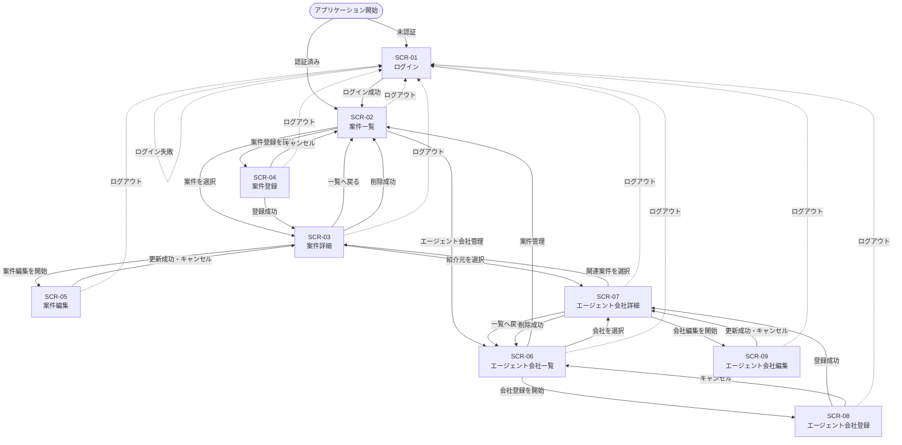
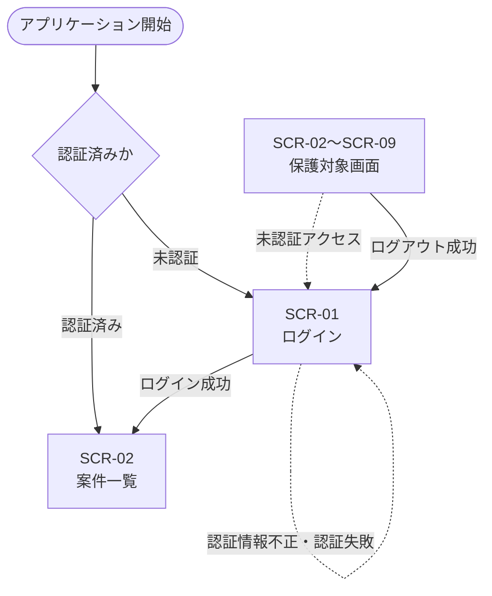
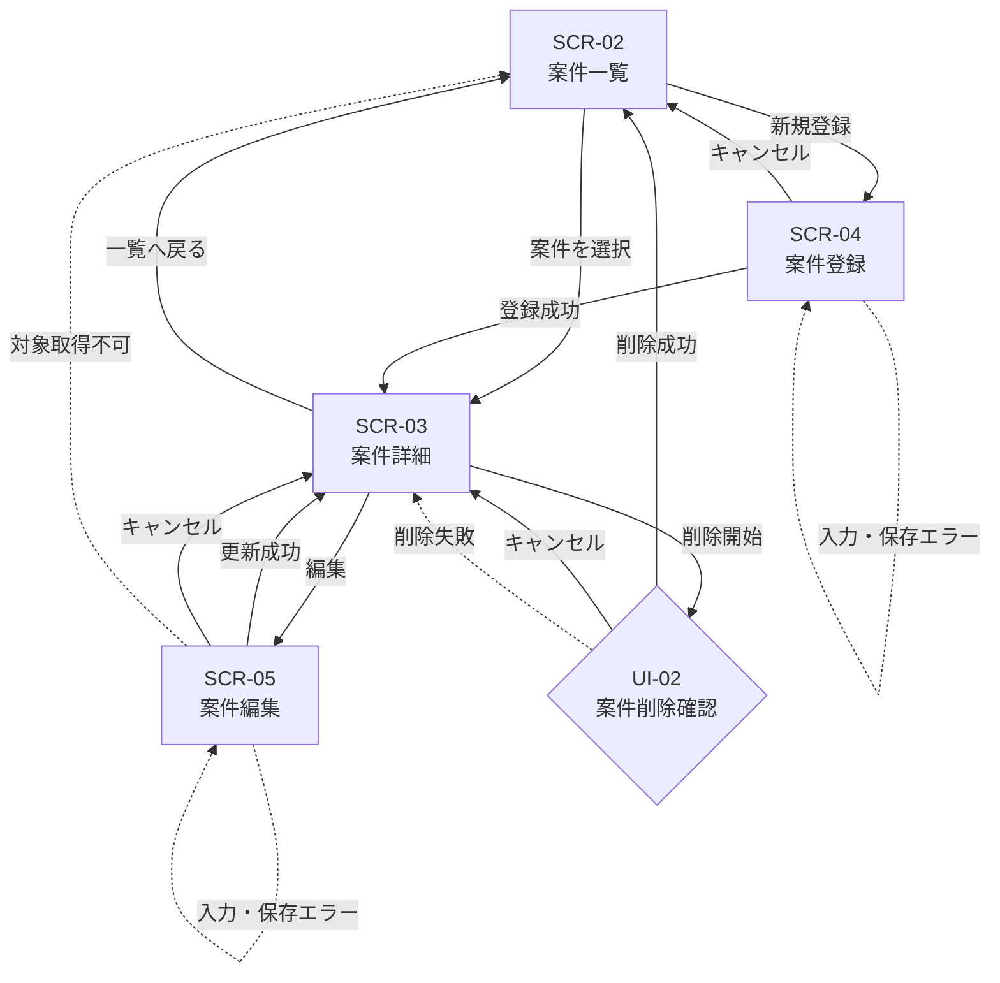
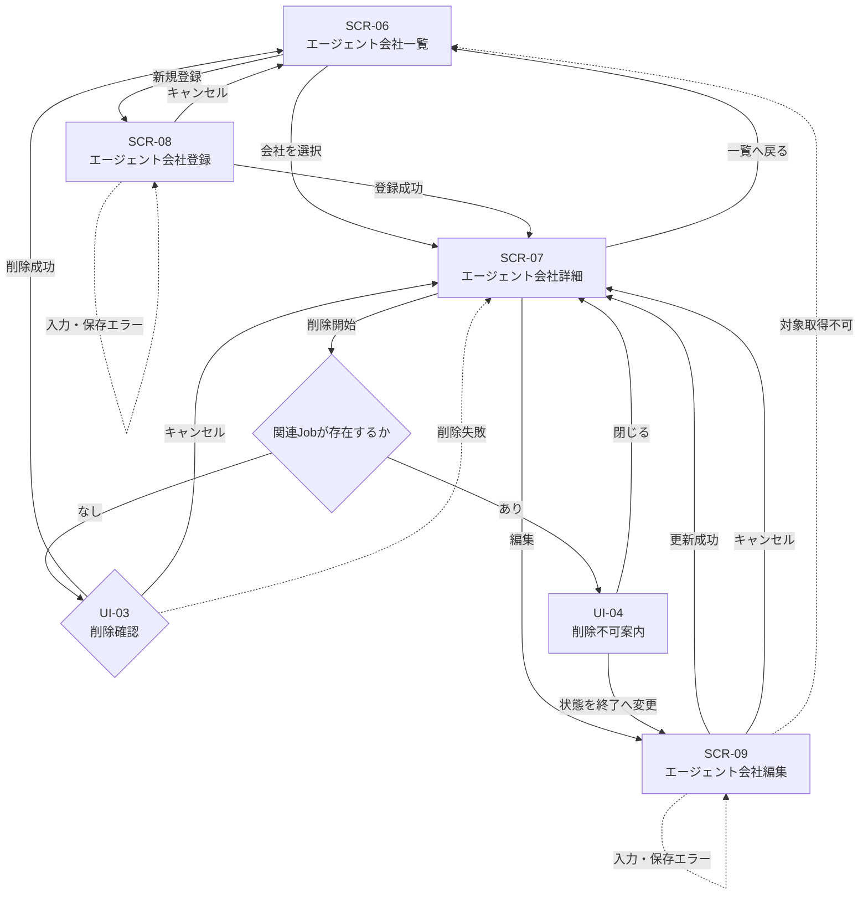
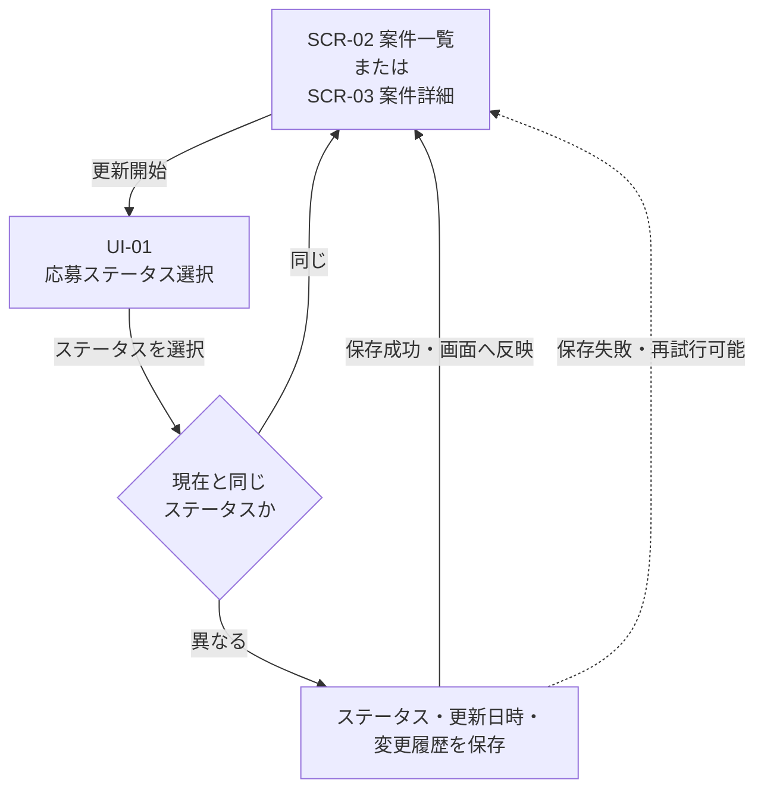

# Sprint 1 画面遷移

## 1. このドキュメントの目的

本書は、Agent Job TrackerのSprint 1で使用する画面について、
ユーザー操作、処理結果および認証状態に応じた画面間の遷移を整理するものである。

本書では、`docs/design/sprint1-screen-list.md`で定義した
画面ID `SCR-01`〜`SCR-09`を使用する。

画面の具体的なレイアウト、URL、ルーティング実装、API仕様、
ブラウザ履歴の制御方法については、本書では確定しない。

---

## 2. 対象範囲

本書では、今回の必須実装範囲であるSprint 1を対象とする。

以下の画面遷移を扱う。

- ログイン
- ログアウト
- 未認証時のアクセス制御
- 案件の一覧・詳細・登録・編集・削除
- エージェント会社の一覧・詳細・登録・編集・削除
- 案件とエージェント会社間の参照
- 応募ステータスの更新
- 入力エラー、通信エラー、保存失敗時の扱い
- スマートフォンで利用可能な画面遷移

Sprint 2以降の機能に関する詳細な画面遷移は対象外とする。

---

## 3. 前提・表記

### 3.1 前提

要求定義書、Sprint 1ユーザーフロー、画面一覧および
GitHub Issue #11でのPM回答に基づき、以下を前提とする。

- ログイン画面以外は認証が必要な保護対象画面とする
- ログイン成功後の初期画面はSCR-02 案件一覧画面とする
- 登録・編集は独立画面で行う
- 登録・編集成功後は対象の詳細画面へ移動する
- 削除成功後は対象の一覧画面へ移動する
- 削除確認は独立画面へ遷移せず、詳細画面上の確認UIで行う
- 応募ステータスはSCR-02またはSCR-03で更新する
- 応募ステータス更新後は画面遷移せず、現在画面へ結果を反映する
- 現在と同じ応募ステータスでは更新操作を無効にする
- Sprint 1では通常の次ステータスを優先表示しない
- Application単独の画面は設けない
- ローディング、空状態、エラー、保存状態は独立画面へ遷移せず、対象画面内で表示する

### 3.2 表記

|表記|意味|
|---|---|
|`SCR-xx`|独立した画面|
|`UI-xx`|画面内の操作・確認UI|
|`TR-xxx`|画面遷移または同一画面内で完了する操作の識別子|
|実線の矢印|ユーザー操作または処理成功による遷移|
|点線の矢印|認証エラー、入力エラー、通信エラーなどの例外時の扱い|

---

## 4. 画面遷移図

## 4.1 全体図

削除確認、応募ステータス更新、ローディング、空状態、エラー表示は、
独立画面へ遷移せず対象画面内で完了するため、全体図では省略している。

## 4.2 認証フロー

未認証ユーザーがどの保護対象画面へアクセスした場合でも、
保護対象の内容を表示せずSCR-01へ移動する。

認証切れを検出した場合の具体的なメッセージと、
ログイン後に元のアクセス先へ戻すかどうかは後続設計で決定する。

## 4.3 案件管理フロー

案件登録成功時にはJobとApplicationが一貫して登録され、
登録した案件のSCR-03へ移動する。

## 4.4 エージェント会社管理フロー

関連Jobが存在するエージェント会社は削除せず、
必要に応じてSCR-09で状態を「終了」へ変更する。

## 4.5 応募ステータス更新フロー

現在と同じステータスでは更新操作を無効にし、
更新日時とステータス変更履歴を変更しない。

更新成功・失敗のいずれの場合も別画面へは移動せず、
操作を開始したSCR-02またはSCR-03に留まる。

---

## 5. 画面遷移一覧

## 5.1 認証・共通遷移

|遷移ID|遷移元|操作・条件|遷移先|備考|
|---|---|---|---|---|
|TR-001|アプリケーション開始|未認証|SCR-01|ログイン画面を表示する|
|TR-002|アプリケーション開始|認証済み|SCR-02|ログイン後の初期画面|
|TR-003|SCR-01|ログイン成功|SCR-02|認証状態を開始する|
|TR-004|SCR-01|未入力、認証情報不正、認証失敗|SCR-01|エラーを表示して留まる|
|TR-005|SCR-02〜SCR-09|未認証状態でアクセス|SCR-01|保護対象の内容を表示しない|
|TR-006|SCR-02〜SCR-09（UI-05）|ログアウト成功|SCR-01|認証状態を解除する|
|TR-007|SCR-02〜SCR-09（UI-05）|ログアウト処理失敗|遷移しない|現在画面で失敗と再試行方法を表示する|

## 5.2 案件管理

|遷移ID|遷移元|操作・条件|遷移先|備考|
|---|---|---|---|---|
|TR-101|SCR-02|案件を選択|SCR-03|選択した案件を表示する|
|TR-102|SCR-03|案件一覧へ戻る|SCR-02|削除されていない案件を表示する|
|TR-103|SCR-02|案件登録を開始|SCR-04|デスクトップのみ|
|TR-104|SCR-04|JobとApplicationの登録成功|SCR-03|登録した案件を表示する|
|TR-105|SCR-04|登録をキャンセル|SCR-02|保存しない|
|TR-106|SCR-04|入力エラーまたは登録失敗|遷移しない|入力内容を可能な範囲で保持する|
|TR-107|SCR-03|案件編集を開始|SCR-05|デスクトップのみ|
|TR-108|SCR-05|更新成功|SCR-03|更新後の案件を表示する|
|TR-109|SCR-05|編集をキャンセル|SCR-03|変更を保存しない|
|TR-110|SCR-05|入力エラーまたは更新失敗|遷移しない|入力内容を可能な範囲で保持する|
|TR-111|SCR-05|編集対象を取得できない|SCR-02|対象を確認できないことを表示する|
|TR-112|SCR-03、UI-02|案件削除成功|SCR-02|Jobを論理削除し、関連履歴を保持する|
|TR-113|SCR-03、UI-02|削除をキャンセルまたは削除失敗|遷移しない|SCR-03に留まる|

## 5.3 エージェント会社管理

|遷移ID|遷移元|操作・条件|遷移先|備考|
|---|---|---|---|---|
|TR-201|SCR-02|エージェント会社管理を開始|SCR-06|共通ナビゲーションを使用する|
|TR-202|SCR-06|案件管理へ戻る|SCR-02|共通ナビゲーションを使用する|
|TR-203|SCR-06|エージェント会社を選択|SCR-07|選択した会社を表示する|
|TR-204|SCR-07|エージェント会社一覧へ戻る|SCR-06|削除されていない会社を表示する|
|TR-205|SCR-06|エージェント会社登録を開始|SCR-08|デスクトップのみ|
|TR-206|SCR-08|登録成功|SCR-07|登録した会社を表示する|
|TR-207|SCR-08|登録をキャンセル|SCR-06|保存しない|
|TR-208|SCR-08|入力エラーまたは登録失敗|遷移しない|入力内容を可能な範囲で保持する|
|TR-209|SCR-07|エージェント会社編集を開始|SCR-09|デスクトップのみ|
|TR-210|SCR-09|更新成功|SCR-07|更新後の会社を表示する|
|TR-211|SCR-09|編集をキャンセル|SCR-07|変更を保存しない|
|TR-212|SCR-09|入力エラーまたは更新失敗|遷移しない|入力内容を可能な範囲で保持する|
|TR-213|SCR-09|編集対象を取得できない|SCR-06|対象を確認できないことを表示する|
|TR-214|SCR-07、UI-03|関連Jobなし・削除成功|SCR-06|AgentCompanyを論理削除する|
|TR-215|SCR-07、UI-03|削除をキャンセルまたは削除失敗|遷移しない|SCR-07に留まる|
|TR-216|SCR-07、UI-04|関連Jobあり|遷移しない|削除できない理由を表示する|
|TR-217|UI-04|状態を「終了」へ変更する|SCR-09|削除の代わりに編集を開始する|

## 5.4 案件・エージェント会社間の参照

|遷移ID|遷移元|操作・条件|遷移先|備考|
|---|---|---|---|---|
|TR-301|SCR-03|紹介元エージェント会社を選択|SCR-07|紹介元の詳細を表示する|
|TR-302|SCR-07|関連案件を選択|SCR-03|選択した案件を表示する|

## 5.5 応募ステータス更新

|遷移ID|遷移元|操作・条件|遷移先|備考|
|---|---|---|---|---|
|TR-401|SCR-02、UI-01|現在と異なるステータスへの更新成功|遷移しない|SCR-02へ更新後の状態を反映する|
|TR-402|SCR-02、UI-01|現在と異なるステータスへの更新失敗|遷移しない|SCR-02で失敗と再試行方法を表示する|
|TR-403|SCR-02、UI-01|現在と同じステータスを選択|遷移しない|更新操作を無効にし、保存しない|
|TR-404|SCR-03、UI-01|現在と異なるステータスへの更新成功|遷移しない|SCR-03へ更新後の状態を反映する|
|TR-405|SCR-03、UI-01|現在と異なるステータスへの更新失敗|遷移しない|SCR-03で失敗と再試行方法を表示する|
|TR-406|SCR-03、UI-01|現在と同じステータスを選択|遷移しない|更新操作を無効にし、保存しない|

---

## 6. 画面遷移を伴わない状態変化

以下は独立画面への遷移ではなく、対象画面内の状態変化として扱う。

|状態変化|対象画面・UI|扱い|
|---|---|---|
|データ取得開始・完了|SCR-02、SCR-03、SCR-05、SCR-06、SCR-07、SCR-09|ローディングを表示し、取得完了後に内容またはエラーを表示する|
|空状態|SCR-02、SCR-06|データがないことと、利用可能な次の操作を表示する|
|入力エラー|SCR-01、SCR-04、SCR-05、SCR-08、SCR-09|対象画面に留まり、項目、原因、修正方法を表示する|
|保存中|SCR-04、SCR-05、SCR-08、SCR-09、UI-01〜UI-03|処理中を表示し、同一操作の重複実行を防ぐ|
|保存失敗|SCR-02〜SCR-09、UI-01〜UI-03|成功扱いにせず、対象画面で再試行可能な状態にする|
|ステータス更新成功|SCR-02、SCR-03、UI-01|現在画面に更新結果を反映する|
|案件削除キャンセル・失敗|SCR-03、UI-02|SCR-03に留まる|
|エージェント会社削除キャンセル・失敗・削除不可|SCR-07、UI-03、UI-04|SCR-07に留まる|

具体的なローディング、エラー、成功表示、フォーカス位置は
ワイヤーフレームおよび入力・エラー設計で決定する。

---

## 7. スマートフォンでの画面遷移

### 7.1 利用可能な遷移

スマートフォンでは、以下の遷移と同一画面内操作を利用可能とする。

- SCR-01からSCR-02へのログイン
- SCR-02とSCR-03間の案件一覧・詳細閲覧
- SCR-02とSCR-06間の案件・エージェント会社管理の切り替え
- SCR-06とSCR-07間のエージェント会社一覧・詳細閲覧
- SCR-03からSCR-07への紹介元エージェント会社参照
- SCR-07からSCR-03への関連案件参照
- SCR-02またはSCR-03での応募ステータス更新
- SCR-02、SCR-03、SCR-06、SCR-07からSCR-01へのログアウト

### 7.2 利用不可とする遷移

スマートフォンでは、以下の画面への遷移と操作を利用不可とする。

- SCR-04 案件登録画面への遷移
- SCR-05 案件編集画面への遷移
- SCR-08 エージェント会社登録画面への遷移
- SCR-09 エージェント会社編集画面への遷移
- 案件削除
- エージェント会社削除

利用できない操作の表示・非表示、無効化、案内方法は
後続のワイヤーフレームで決定する。

---

## 8. ユースケース・遷移対応表

|ユースケース|主な遷移ID|
|---|---|
|UC-01 ログインする|TR-001〜TR-005|
|UC-02 エージェント会社を登録する|TR-205〜TR-208|
|UC-03 エージェント会社を確認する|TR-203、TR-204、TR-302|
|UC-04 エージェント会社を編集する|TR-209〜TR-213|
|UC-05 エージェント会社を削除する|TR-214〜TR-217|
|UC-06 案件を登録する|TR-103〜TR-106|
|UC-07 案件を確認する|TR-101、TR-102、TR-301|
|UC-08 案件を編集する|TR-107〜TR-111|
|UC-09 案件を削除する|TR-112、TR-113|
|UC-10 応募ステータスを更新する|TR-401〜TR-406|
|UC-11 ログアウトする|TR-006、TR-007|

---

## 9. 後続設計で決定する事項

### ワイヤーフレーム

- 共通ナビゲーションの具体的な構成
- 戻る操作とキャンセル操作の配置
- 削除確認UIの具体的な形式、文言、フォーカス制御
- 応募ステータス選択UIの具体的な形式
- ローディング、空状態、エラー、成功結果の表示方法
- スマートフォンで利用不可となる操作の案内方法

### ルーティング・認証設計

- 各画面のURLとルーティングパス
- 認証状態の保持方法
- 認証切れを検出する方法
- 未認証アクセス前の遷移先をログイン後に復元するか
- ブラウザの戻る・進む操作時の扱い
- ログアウト失敗時の具体的な認証状態

### API・データ設計

- JobとApplicationを一貫して登録する方法
- ステータス更新と変更履歴を一貫して保存する方法
- 削除処理と一覧反映の方法
- 画面遷移前後のデータ再取得方法

---

## 10. 関連資料

- `docs/design/sprint1-screen-list.md`
- `docs/design/sprint1-user-flows.md`
- `docs/requirements/revised-product-requirements.md`
- `docs/requirements/explicit-decision-points.md`
- `docs/requirements/developer-raised-questions.md`
- GitHub Issue：`[DESIGN-01] 主要ユースケースとユーザーフローを整理する`
- GitHub Issue：`[DESIGN-02] Sprint 1の画面一覧と画面遷移を整理する`
- 親Issue：`[SPRINT-0] 要件整理・設計・開発準備`
