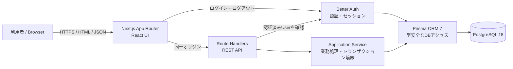

# Sprint 1 技術構成・選定理由

## 1. 文書情報

|項目|内容|
|---|---|
|対応Issue|TECH-01|
|対象|Agent Job Tracker Sprint 1|
|目的|Sprint 1の実装、詳細設計およびローカル開発環境構築の基準となる技術構成を定める|
|選定基準日|2026-08-24|
|位置付け|基本技術設計。製品仕様ではなく、既存要件を実現するためのDeveloper案を含む|

本書は、要求定義書およびDESIGN-01〜05を実現する技術構成と、その選定理由を整理する。

本書で「採用」とした内容は、Sprint 1の実装を具体化するための技術判断である。ログインに使用する項目など、画面・APIまたは利用者の操作へ影響する内容は、技術的に実現可能な候補を示すにとどめ、製品仕様として先に確定しない。

---

## 2. 対象範囲

### 2.1 対象

- Sprint 1のWebアプリケーション全体構成
- フロントエンド、API、認証およびDBの責務分担
- 言語、ランタイム、フレームワーク、ORMおよび主要開発ツール
- ローカル開発、テストおよびデプロイの基本方針
- トランザクションを必要とする業務処理の実現方針
- 後続設計で確定する事項の境界

### 2.2 対象外

- 物理テーブル・カラムの完全な定義
- 全APIの厳密なJSON Schema
- 全入力項目の最大長、NULL可否およびエラーメッセージ
- Cookie、セッション、CSRFおよびCSPの最終設定値
- UIコンポーネントの詳細設計
- CI/CDワークフローの実装
- 本番サービス事業者との契約および課金プランの決定
- Sprint 2以降の機能に固有の構成

---

## 3. 設計上の前提

### 3.1 既存資料から確定できる内容

- Sprint 1はログイン、AgentCompany、JobおよびApplicationステータス管理を対象とする
- 利用者向けユーザー登録は行わず、事前作成した1ユーザーのみを使用する
- ログイン画面以外の画面とAPIは認証を必要とする
- デスクトップとスマートフォンは原則として同じAPIを使用する
- Application単独の管理画面は設けない
- Job登録時に初期ステータス「未応募」のApplicationを自動作成する
- JobとApplicationの一方だけが保存された状態にしない
- JobおよびAgentCompanyは論理削除する
- Job削除後もApplicationとApplicationStatusHistoryを保持する
- 論理削除済みを含む関連Jobが存在するAgentCompanyは削除できない
- Applicationステータス変更と履歴追加を一つの整合した処理として扱う
- 同一ステータスへの更新では更新日時と履歴を変更しない
- JobおよびAgentCompanyの一覧は作成日時降順とする
- Sprint 1ではJobおよびAgentCompanyの検索・絞り込みを実装しない

### 3.2 技術構成に求める性質

1. Sprint 1の規模に対して運用要素を増やしすぎない
2. UIからDBまでTypeScriptで型を共有しやすい
3. REST APIを画面と同じリポジトリで実装できる
4. PostgreSQLのトランザクションと参照整合性を利用できる
5. 認証情報をアプリケーションコードへ直書きしない
6. 単体、結合およびE2Eの各層を自動テストできる
7. ローカル環境を別の開発者が再現できる
8. 後からフロントエンドとAPIを分離する必要が生じても、業務ロジックを移しやすい

---

## 4. 採用する全体構成

Sprint 1では、1つのNext.jsアプリケーションに画面とREST APIを配置し、PostgreSQLへ接続するモジュラーモノリスを採用する。



### 4.1 採用理由

- 画面とAPIを別サービスに分けるより、Sprint 1の開発・起動・デプロイ対象を少なくできる
- 同一オリジンのCookieベース認証を構成しやすい
- API層と業務処理層を分離すれば、単一アプリでも責務を保てる
- 必要になった時点でAPIまたは業務処理を別サービスへ移す余地を残せる
- Next.js Route HandlersはRESTで必要な`GET`、`POST`、`PATCH`および`DELETE`を扱える

### 4.2 採用しない構成

Sprint 1では、マイクロサービス、独立したBFF、イベント駆動基盤、Kubernetesおよび常設メッセージブローカーを採用しない。現在の機能数と利用者数に対して、デプロイ、監視、障害切り分けおよびローカル環境の負担が大きいためである。

---

## 5. 採用技術一覧

|領域|採用案|バージョン方針|主な理由|
|---|---|---|---|
|ランタイム|Node.js|24 LTSの最新パッチ|選定時点でLTS。Next.jsとPrismaの要件を満たす|
|言語|TypeScript|依存関係と互換性のある安定版を固定|画面、API、検証、DBアクセスを同じ型体系で扱える|
|Webフレームワーク|Next.js App Router|16系の安定版を固定|画面とRoute Handlersを単一アプリで構成できる|
|UI|React|Next.jsがサポートする安定版を固定|App Routerの標準UI層|
|CSS|Tailwind CSS|4系の安定版を固定|レスポンシブ調整と共通スタイルを小規模に開始しやすい|
|DB|PostgreSQL|18系の最新マイナー|トランザクション、外部キー、制約および索引を利用できる|
|ORM・Migration|Prisma ORM|7系GAの最新互換版を固定|型安全なClientとMigrationを同じツールで扱える|
|認証|Better Auth|安定版を固定|同一Next.jsアプリでDBセッションと資格情報認証を構成できる|
|入力検証|Zod|4系の安定版を固定|TypeScriptと対応するスキーマをAPI境界で利用できる|
|単体・結合テスト|Vitest|安定版を固定|TypeScriptを扱いやすく、業務ロジックを高速に検証できる|
|UIテスト支援|React Testing Library|安定版を固定|実装内部より利用者操作に近いDOM検証を行える|
|E2E|Playwright|安定版を固定|主要ブラウザとモバイル相当Viewportでフローを確認できる|
|パッケージ管理|pnpm|リポジトリで固定|lockfileと`packageManager`で再現性を確保する|
|Lint|ESLint Flat Config|Next.js互換の安定版を固定|コード品質規則を自動確認できる|
|Format|Prettier|安定版を固定|フォーマットをLintの責務から分離できる|
|ローカルDB|Docker Compose|Compose v2|開発者ごとの差を抑えてPostgreSQLを起動できる|

「最新」をそのままインストールし続けるのではなく、開発環境構築時点の互換性を確認したうえで`package.json`、lockfile、Node.jsバージョンファイルおよびDocker image tagへ固定する。

---

## 6. レイヤーと責務

|レイヤー|主な責務|行わないこと|
|---|---|---|
|Presentation|画面表示、入力、操作状態、アクセシビリティ|DBへ直接アクセスしない|
|Route Handler|HTTP解析、認証確認、入力検証、レスポンス変換|業務ルールを大量に埋め込まない|
|Application Service|ユースケース実行、業務ルール、トランザクション境界|HTTP固有のRequest/Responseへ依存しない|
|Repository / Prisma|永続化、取得条件、論理削除条件|画面遷移を判断しない|
|Auth|資格情報検証、セッション作成・検証・破棄|AgentCompanyやJobの業務処理を行わない|
|PostgreSQL|永続化、外部キー、一意性、トランザクション|画面向け文言を保持しない|

想定する配置例は次のとおりである。最終的なフォルダ名は環境構築Issueで確定する。

```text
src/
  app/                 # Pages、Layouts、Route Handlers
  features/            # 画面・機能単位のUIとクライアント処理
  server/
    application/       # ユースケースとトランザクション境界
    domain/            # 業務ルール、列挙値、エラー
    repositories/      # Prismaを使用した永続化
    auth/              # Better Auth設定と認証ヘルパー
  shared/              # 共通UI、型、検証、ユーティリティ
prisma/                # Prisma schema、migration、seed
tests/                 # 結合・E2Eテスト
```

Server Componentから表示データを取得する場合は、同一サーバー内のRoute HandlerへHTTPで再アクセスせず、Application Serviceを直接呼び出す。ブラウザからの操作と外部から検証可能なREST契約にはRoute Handlerを使用する。

---

## 7. API実現方針

- DESIGN-04のREST方針と`/api`基底パスを維持する
- `app/api/**/route.ts`はHTTPアダプターとして薄く保つ
- Request body、pathおよびqueryをZodで検証してからApplication Serviceへ渡す
- 認証済みUserはRoute Handlerまたは共通ガードで取得し、変更者としてServiceへ明示的に渡す
- Domain/ApplicationエラーをHTTPステータスと共通エラー形式へ変換する
- 内部例外、SQL、stack trace、Cookieおよび資格情報をレスポンスへ含めない
- デスクトップとスマートフォンで同じRoute Handlerを使用する

Next.jsの`proxy`は早期リダイレクトの補助に使用できるが、Cookieの存在だけを根拠に保護対象データを返さない。保護対象画面のサーバー処理および各APIで有効なセッションを確認する。

---

## 8. 認証の基本構成

### 8.1 技術判断

- Better AuthをNext.jsへ統合する
- サーバー管理のDBセッションとHttpOnly Cookieを基本とする
- 利用者向けsign-up機能は無効化する
- 初期ユーザーはseedまたはサーバー側管理コマンドで作成する
- 認証情報、session secretおよびDB接続情報は環境変数で与える
- 保護対象画面の表示前と保護対象APIの処理前にセッションを検証する
- ログアウトではサーバー側セッションを無効化し、Cookieを破棄する

### 8.2 製品判断として残す事項

既存資料からログイン識別子を確定できないため、以下は本書で確定しない。

- ログイン項目をメールアドレスとするか、ユーザー名とするか
- SCR-01へ表示する具体的なラベルと入力例
- 認証失敗時の最終メッセージ
- ログイン後に未認証アクセス前のURLへ戻すか、常にSCR-02へ移動するか

Better Authはemail/passwordとusername pluginの両方を候補にできる。後続の認証設計で上記を決定してから、AUTH-01・AUTH-02とBetter Authの内部endpointの対応方法を確定する。

### 8.3 後続の認証詳細設計事項

- Cookie名、`Secure`、`HttpOnly`、`SameSite`および有効期間
- CSRF対策
- セッション更新と失効方法
- ログイン試行回数制限
- 初期パスワードの安全な受け渡しと変更方法
- Better Auth用Userと論理モデル上のUserの対応
- `/api/auth/login`・`/api/auth/logout`とライブラリendpointのアダプター方針

---

## 9. データアクセスとトランザクション

### 9.1 基本方針

- Prisma schemaを物理データモデルとMigrationの原本とする
- PostgreSQLの外部キーと一意性制約で、DBが保証できる整合性をDBにも持たせる
- 論理削除対象の通常取得には`deletedAt IS NULL`相当の条件を必ず適用する
- 業務上意味のある複数更新はPrisma transaction内で実行する
- API処理から個別のPrisma書き込みを並べず、Application Serviceへ集約する

### 9.2 必須トランザクション

|処理|同一トランザクションに含める内容|失敗時|
|---|---|---|
|Job登録|Job作成、初期Application作成|すべてrollback|
|Applicationステータス変更|現在値確認、Application更新、履歴追加|すべてrollback|
|Job削除|削除対象確認、Jobの`deletedAt`更新|すべてrollback|
|AgentCompany削除|論理削除済みを含む関連Job確認、AgentCompanyの`deletedAt`更新|条件不成立または競合時は更新しない|

同一ステータス更新は、Applicationの更新と履歴追加を実行せず、DESIGN-04で定義した競合エラーへ変換する。

### 9.3 後続の物理設計事項

- トランザクション分離レベル
- AgentCompany削除判定とJob作成の競合を防ぐlockまたは制約
- ID生成方式
- DB上の単価保存単位
- 文字列長、NULL可否、列挙値の物理表現
- 索引の物理構成
- Better Authテーブルと業務テーブルのschema配置

---

## 10. フロントエンド方針

- Next.js App RouterのPage、Layout、Server Componentを基本とする
- 入力、モーダル、ステータス選択など操作を必要とする部分だけClient Componentとする
- SCR-01〜09の画面IDを実装・テスト上の追跡情報として維持する
- DesktopとMobileで別アプリを作らず、同じReact UIをresponsive layoutで切り替える
- Mobileで登録・編集・削除の実行UIを提供しない
- 共通の色、余白、文字サイズはCSS custom propertiesまたはTailwind themeへ集約する
- Loading、Empty、Validation Error、Communication ErrorおよびSaving状態を明示する
- button、link、label、dialogなど標準的なsemantic HTMLを優先する
- キーボード操作、focus移動および見えるfocus indicatorを実装時に確認する

Tailwind CSSは配置とresponsive variationを効率よく記述するために使用する。複雑なUI kitを先に導入して、未確定のvisual designを固定しない。

---

## 11. 入力検証とエラー

### 11.1 入力検証

- Zod schemaをHTTP入力境界で必ず適用する
- client側検証は操作性向上のために行うが、server側検証を省略しない
- clientとserverで共有できるfield schemaは共有する
- DB制約違反だけに依存せず、利用者へ返す業務エラーをApplication Serviceで判定する
- 最大長、許容値および`null`・空文字の扱いは後続の入力・エラー設計で確定する

### 11.2 エラー分類

|分類|例|扱い|
|---|---|---|
|Validation|必須、形式、値域|field pathを持つ`422`候補|
|Authentication|未認証、資格情報不正|`401`。詳細を出しすぎない|
|Not Found|対象なし、通常参照できない削除済み対象|`404`|
|Conflict|関連Jobあり、同一ステータス、更新競合|`409`|
|Unexpected|予期しない例外|`500`。内部情報を返さない|

最終的なerror code、messageおよびfield pathは後続設計で確定する。

---

## 12. テスト構成

|層|主な対象|採用ツール|DB|
|---|---|---|---|
|Unit|Domain rule、変換、Zod schema|Vitest|原則不要|
|Component|form、status selector、dialog、状態表示|Vitest + React Testing Library|mockまたは不要|
|Integration|Application Service、Repository、Route Handler|Vitest|test用PostgreSQL|
|E2E|ログイン、主要CRUD、削除制限、ステータス更新、ログアウト|Playwright|test用PostgreSQL|

### 12.1 優先して自動化する結合・E2E観点

- JobとApplicationが同時に作成される
- Job作成失敗時にApplicationだけが残らない
- ステータス変更と履歴追加が同時に成功または失敗する
- 同一ステータス指定時にApplicationと履歴が変化しない
- 論理削除済みJobがあってもAgentCompanyを削除できない
- 未認証時に保護対象画面・APIを利用できない
- Mobile viewportで閲覧とステータス更新が可能で、登録・編集・削除導線が提供されない

Async Server ComponentはE2Eを優先し、純粋な業務処理やClient Componentへ単体・component testを集中させる。

---

## 13. ローカル開発環境

### 13.1 構成

- Node.jsアプリケーションはhost上で起動する
- PostgreSQLはDocker Composeで起動する
- Migrationとseedはpnpm scriptから実行する
- 初期ユーザーは平文passwordをリポジトリへ保存せず、環境変数または対話入力から作成する
- `.env.example`には変数名とダミー値だけを記載する
- `.env.local`など秘密情報を含むファイルはGit管理しない

アプリケーションまで常時container化しないのは、Next.jsの開発serverとdebuggerを簡単に利用するためである。CIまたは本番相当起動でcontainer imageが必要になった場合は、環境構築Issueで追加する。

### 13.2 想定コマンド

以下は環境構築Issueでpackage scriptsへ具体化する。

```text
pnpm install
docker compose up -d db
pnpm db:migrate
pnpm db:seed
pnpm dev
pnpm lint
pnpm format:check
pnpm typecheck
pnpm test
pnpm test:e2e
pnpm build
```

---

## 14. 環境と秘密情報

|環境|用途|DB|秘密情報|
|---|---|---|---|
|development|日常開発|local PostgreSQL|開発者の`.env.local`|
|test|自動テスト|分離したtest DB|test専用値|
|production-like|build・E2E・リリース前確認|本番と同系統|CIまたはhostingのsecret store|

- clientへ公開してよい値以外に`NEXT_PUBLIC_`を付けない
- DB URL、session secretおよび初期ユーザーpasswordをlogへ出さない
- repositoryへ実値をcommitしない
- secretの変更手順と失効手順は環境構築時にREADMEへ記載する

---

## 15. デプロイ方針

### 15.1 採用する境界

- Next.jsのNode.js runtimeを実行できる単一Webサービス
- PostgreSQL互換のmanaged database
- WebサービスとDBは暗号化された接続を使用する
- Migrationはdeploy前後の明示的なstepとして実行する
- filesystemへの永続保存を前提としない

### 15.2 今回確定しない内容

- Vercel、Cloudflare、AWSなどのWeb hosting事業者
- Neon、Supabase、Prisma Postgresなどのmanaged PostgreSQL事業者
- 独自domain、backup期間、監視サービスおよび課金plan

事業者選択は費用、無料枠、region、backup、接続数、serverless接続方式および学習目的を比較し、ローカル環境構築後に決定する。特定事業者の無料枠を製品仕様の前提にしない。

---

## 16. ログと基本的な監視

- server側で構造化logを出力できるinterfaceを用意する
- request単位のtrace/request IDを後続のAPI詳細設計で検討する
- error種別、API ID、処理結果および処理時間を記録候補とする
- password、Cookie、Authorization情報および個人の連絡先を記録しない
- application errorとunexpected errorを区別する
- 監視vendorと保持期間はdeploy先決定後に選択する

Sprint 1では専用log基盤を先に構築せず、hostingの標準logで確認できる形式から開始する。

---

## 17. バージョン固定と更新

- Node.jsは24 LTSのminor/patchをバージョンファイルで固定する
- `package.json`の`packageManager`へpnpm versionを記録する
- 依存関係は`pnpm-lock.yaml`をcommitする
- PostgreSQL Docker imageはmajorだけでなく検証済みminorまたはdigestの固定を検討する
- Prisma 8は選定時点でRelease Candidateのため採用せず、GAのPrisma 7を採用する
- major updateは通常の機能PRへ混在させず、変更内容とmigration影響を確認する
- security updateとLTS終了日は定期的に確認する

---

## 18. 主要な代替案との比較

### 18.1 Next.jsモジュラーモノリスと分離SPA/API

|案|利点|欠点|判断|
|---|---|---|---|
|Next.js単一アプリ|起動・deployが少ない。同一origin認証。型を共有しやすい|frameworkへの結合が強い|Sprint 1で採用|
|React SPA + Express/Fastify|frontend/backend境界が明確。独立deployしやすい|repository、CORS、認証、local起動が増える|規模拡大時の候補|
|NestJS + frontend|大規模向け構造とDI|Sprint 1にはboilerplateと学習範囲が大きい|不採用|

### 18.2 PostgreSQLとSQLite

|案|利点|欠点|判断|
|---|---|---|---|
|PostgreSQL|制約、transaction、並行処理、本番利用実績|local serviceが必要|採用|
|SQLite|setupが軽い|本番との差、同時実行、lock特性が異なる|unit test用にも原則使用しない|

Job/Applicationの一括作成やAgentCompany削除判定の競合を学習・検証するため、本番とtestで同系統のPostgreSQLを使用する。

### 18.3 PrismaとDrizzle

|案|利点|欠点|判断|
|---|---|---|---|
|Prisma|schema、型付きClient、Migration、Studioが一体|独自schemaと生成stepがある|採用|
|Drizzle|SQLに近く軽量|物理SQL知識とschema管理判断が増える|SQL中心の学習を優先する場合の候補|
|直接SQL|挙動が明確|mappingとmigrationの自前範囲が増える|局所的escape hatchのみ|

### 18.4 Better Authと外部認証SaaS

|案|利点|欠点|判断|
|---|---|---|---|
|Better Auth + PostgreSQL|同一repository・DBで学習でき、sessionを制御できる|security設定と運用責任を持つ|採用|
|Supabase Auth / Clerk等|認証運用の一部を委譲できる|外部service、無料枠、provider固有仕様への依存|将来候補|
|自作password認証|全処理を学べる|脆弱性を作りやすく保守責任が大きい|不採用|

### 18.5 VitestとJest

|案|利点|欠点|判断|
|---|---|---|---|
|Vitest|TypeScript/ESMを扱いやすく高速|Jestより既存事例が少ない領域がある|採用|
|Jest|導入事例とecosystemが大きい|ESM/transform設定が増える場合がある|既存資産がある場合の候補|

### 18.6 Tailwind CSSとcomponent library

|案|利点|欠点|判断|
|---|---|---|---|
|Tailwind CSS|responsive調整が速く、design tokenへ集約できる|class記述が増える|採用|
|CSS Modules|依存が少なくCSSを直接学べる|共通ruleの設計が必要|代表的代替案|
|MUI等|accessibilityを考慮した部品を利用できる|見た目と設計思想への結合が強い|visual design確定後に再検討|

---

## 19. 既存資料との対応

|既存設計|技術構成での対応|
|---|---|
|SCR-01〜09|Next.js App Routerの画面として実装|
|UI-01〜05|React Client Componentを必要範囲で使用|
|AUTH-01・02|Better Authとapplication endpointの対応を認証詳細設計で定義|
|AC-01〜05|AgentCompany用Route HandlerとApplication Service|
|JOB-01〜05|Job用Route HandlerとApplication Service|
|APP-01・02|Job配下のApplication status用Route Handler|
|User|Better Authの認証主体との対応を後続設計|
|AgentCompany|Prisma modelとPostgreSQL tableへ物理化|
|Job|Prisma modelとPostgreSQL tableへ物理化|
|Application|Jobとの1対1制約を物理設計|
|ApplicationStatusHistory|ApplicationとUserへの参照を物理設計|

---

## 20. 製品判断が必要な未決事項

技術候補だけでは確定できず、利用者の操作または製品の振る舞いへ影響するため、PM判断を必要とする。

1. ログイン識別子をメールアドレスとするか、ユーザー名とするか
2. 認証切れ後の再ログイン成功時に元のURLへ戻すか、常に案件一覧へ移動するか
3. 一覧の標準page sizeと上限
4. DBおよびAPI上の単価単位
5. 各入力項目の最大長、必須条件および空値の扱い
6. 利用者へ表示する入力・通信・業務エラーメッセージ

上記を本書の採用技術から自動的に決定してはならない。

---

## 21. 後続Issueで決定・実施する内容

### 21.1 認証設計

- ログイン項目と初期ユーザー作成方法
- Better Auth schemaと論理Userの対応
- Cookie、session、CSRF、rate limitおよび認証切れ
- AUTH-01・AUTH-02の具体的なendpoint adapter

### 21.2 物理データ・入力設計

- Prisma schema、物理型、制約、索引およびMigration
- 単価保存単位、最大長、NULL可否および列挙値
- transaction isolationと競合制御
- error code、messageおよびfield path

### 21.3 ローカル開発環境

- Next.js projectの生成
- Node.js、pnpmおよびPostgreSQL versionの固定
- Docker Compose、環境変数、Migrationおよびseed
- Lint、Format、typecheck、testおよびbuild command
- READMEの起動手順

### 21.4 Sprint 1準備

- product backlogの再確認
- 実装Issueへの分解と依存関係設定
- test観点と受け入れ条件の具体化

---

## 22. 公式資料

選定時点の確認には、次の一次資料を使用した。

- [Next.js Installation](https://nextjs.org/docs/app/getting-started/installation)
- [Next.js App Router](https://nextjs.org/docs/app)
- [Next.js Route Handlers](https://nextjs.org/docs/app/getting-started/route-handlers)
- [Next.js Backend for Frontend](https://nextjs.org/docs/app/guides/backend-for-frontend)
- [Next.js Testing Guide](https://nextjs.org/docs/app/guides/testing)
- [Node.js Releases](https://nodejs.org/en/about/previous-releases)
- [Prisma ORM Overview](https://www.prisma.io/docs/orm)
- [Prisma System Requirements](https://docs.prisma.io/docs/orm/reference/system-requirements)
- [Prisma Supported Databases](https://docs.prisma.io/docs/orm/reference/supported-databases)
- [PostgreSQL Versioning Policy](https://www.postgresql.org/support/versioning/)
- [Better Auth Installation](https://better-auth.com/docs/installation)
- [Better Auth Next.js Integration](https://better-auth.com/docs/integrations/next)
- [Better Auth Email and Password](https://better-auth.com/docs/authentication/email-password)
- [Better Auth Database](https://better-auth.com/docs/concepts/database)
- [Zod](https://zod.dev/packages/zod)
- [Playwright Installation](https://playwright.dev/docs/intro)
- [Vitest Guide](https://vitest.dev/guide/)
- [React Testing Library](https://testing-library.com/docs/react-testing-library/intro/)
- [Tailwind CSS with Next.js](https://tailwindcss.com/docs/installation/framework-guides/nextjs)
- [ESLint Configuration](https://eslint.org/docs/latest/use/configure/)
- [Prettier Installation](https://prettier.io/docs/install)
- [Docker Compose](https://docs.docker.com/compose/)

---

## 23. 関連資料

- [Agent Job Tracker 要求定義書](../requirements/revised-product-requirements.md)
- [初期資料で明示された実装前論点](../requirements/explicit-decision-points.md)
- [Developerが追加で発見した確認事項](../requirements/developer-raised-questions.md)
- [Sprint 1 ユースケース・ユーザーフロー](sprint1-user-flows.md)
- [Sprint 1 画面一覧](sprint1-screen-list.md)
- [Sprint 1 画面遷移](sprint1-screen-transitions.md)
- [Sprint 1 ワイヤーフレーム](sprint1-wireframes.md)
- [Sprint 1 API一覧・入出力概要](sprint1-api-overview.md)
- [Sprint 1 論理データモデル](sprint1-data-model.md)
